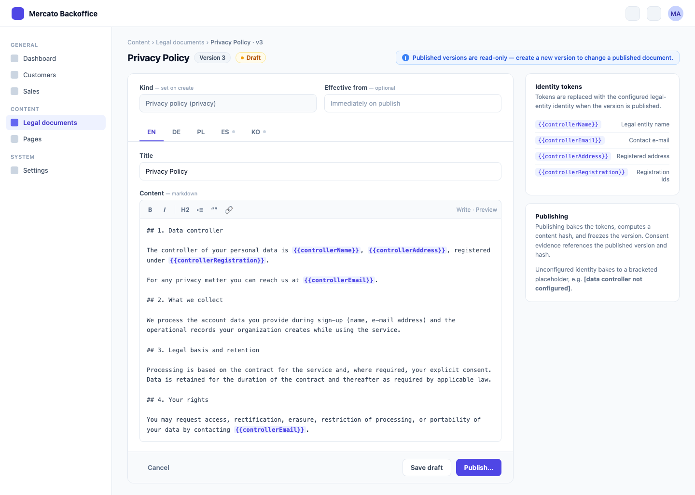
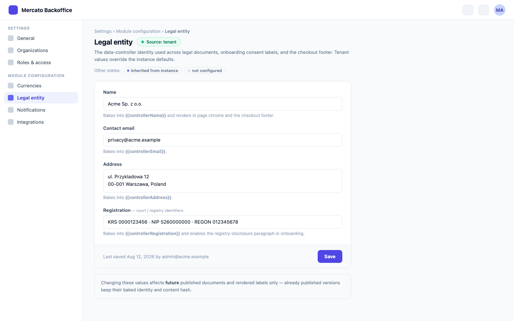

# Tenant Legal Documents and Consent Versioning

> Brief: [`.ai/specs/briefs/2026-08-18-tenant-legal-documents-and-consent-versioning.md`](briefs/2026-08-18-tenant-legal-documents-and-consent-versioning.md). The brief's Resolved-unknowns table pre-answers the module placement (extend `content`), the evidence model (append-only log), the identity storage (tenant-scoped configs), and the checkout stance (defaults + per-link override stays). This spec was authored in an autonomous run; everything the brief left open is resolved in [Resolved assumptions](#resolved-assumptions-autonomous-defaults) below.

## TLDR

**Key Points:**
- Legal documents (`/privacy`, `/terms`) become tenant-scoped, versioned, publishable data records in the `content` module. A fresh install renders a built-in neutral sample clearly banner-marked as a placeholder — never the vendor's legal identity, and never another scope's: a tenant resolves its own rows or the sample, never the instance rows. The vendor's own texts become deployment data of the vendor's own instance (instance-scope rows serving the platform host), not package code.
- Data-controller identity becomes tenant-scoped configuration (`module_configs`, owner `directory`, key `legal_entity`) consumed by `content` documents (token interpolation), `onboarding` consent labels, and the checkout pay-page footer. The next vendor/company rename is a data change, not a multi-module PR.
- `auth` gains an append-only `consent_events` ledger pinning document id, document version, and content hash per grant/withdraw, keyed by a salted subject pseudonym (`subject_ref`) whose salt lives in `consent_subjects` and is destroyed by Art. 17 erasure, with a versioned consent-integrity hash payload that keeps every existing `user_consents` row verifiable forever.

**Scope:**
- `content`: module grows a data slice (entities, migrations, CRUD + publish API, admin pages, `acl.ts`, `setup.ts`, `i18n/`, `cli.ts`), page rendering from records, content-owned tenant resolution for the public pages (`legal_document_domains` bindings + default-tenant setting/env — no dependency on any optional module), neutral fallback, the idempotent `mercato content import-legal-documents` importer that turns markdown files into published records, AGENTS.md contract amendment.
- `directory`: `legal_entity` config key, resolver helper, settings API + settings page, the idempotent `mercato directory set-legal-entity` importer.
- `auth`: `consent_events` + `consent_subjects` entities, `consentLogService`, integrity-hash payload v2 with self-describing version prefix, consent-type registry with document mapping, consent history in the admin user panel, and the `mercato auth erase-consent-subject` CLI command that makes the Art. 17 erasure path reachable in the OSS edition.
- `onboarding`: consent labels neutralized and tokenized in all five locales (including the drifted `ko`), terms acceptance finally recorded as consent evidence with a document snapshot.
- `checkout`: new pay links/templates prefill their legal documents from the tenant's published records; the per-link override is untouched.
- `create-app` template + `apps/mercato`: neutralized `DemoFeedbackWidget` fallbacks via the Template Sync Checklist.
- Identity-lock tests (`packages/content/src/__tests__/legal-entity.test.tsx`, `packages/onboarding/src/__tests__/consent-controller-locales.test.ts`) rewritten into neutral-default locks.

**Out of scope (deferred, tracked in Non-goals):** GDPR Art. 17 erasure orchestration (enterprise spec owns it), a `gdpr` umbrella module, a generic CMS, anything from PR #4561 (`documents` module name is claimed), removal of checkout's per-link documents, portal/end-user self-service consent UI, a withdraw UI (the ledger supports withdrawal; no surface ships it yet), general PII anonymization (upstream #208 — the consent-ledger anonymize-on-erasure in A9 is a deliberately narrow, consent-only slice that neither blocks nor implements it).

**Concerns:**
- The consent-integrity hash payload has been through three security fixes (#2690, #2726, #2743). The versioning design below is explicitly additive (old rows keep verifying under the frozen v1 payload) but still touches that surface — flagged for human confirmation.
- `content`'s AGENTS.md today forbids exactly what this spec adds ("stateless components, no business logic, no API calls"). The amendment is a deliberate, in-scope contract change, not an oversight.

## Resolved assumptions (autonomous defaults)

The brief pre-answered the always-checked split question: this is **one OSS spec** by explicit user decision ("One OSS spec, owned by the `content` module, with the template-defaults neutralization as its independently shippable phase 1"), with rejected alternatives recorded in the brief. The table lists only what the brief left open, resolved per om-spec-writing's autonomous-defaults rules.

| # | Question left open by the brief | Autonomous default | Rationale | Flag |
|---|---|---|---|---|
| A1 | Does the append-only log replace `UserConsent`? | Coexist. New `consent_events` table is the evidence; `user_consents` stays as the mutable current-state projection, upserted by the same service in the same transaction. | Removing or repurposing `user_consents` would break the ADDITIVE-ONLY schema contract and the STABLE `GET /api/auth/users/consents` response; the projection keeps the existing admin panel working unchanged. | — |
| A2 | How do existing rows stay verifiable when the hash payload gains document fields? | Self-describing prefix on the stored hash. Legacy rows (bare hex) verify against the frozen v1 7-field payload forever; new projection writes store `v2:<hex>` over a JSON-array payload with an in-payload domain tag; ledger rows store `cev1:<hex>` over their own event payload. Golden-hash unit tests pin all three byte layouts. No re-hash migration, ever. | The only design that never flips `integrityValid` on stored rows. Still a change to a thrice-audited security surface, so a human should confirm the payload shapes before implementation. | ✅ Confirmed by maintainer 2026-08-18 (precedent: the `documents` module's prefixed-digest convention, PR #4561) |
| A3 | How is the consentType→document mapping declared (marketing has none; terms/privacy do)? | A static registry in `auth`'s `lib/consentTypes.ts`: `consentTypeDefinitions` with `{ id, labelKey, documentKind? }`. `marketing_email` → no document; new types `terms` → kind `terms`, `privacy` → kind `privacy`. The link is a string kind, never an import of `content`. | Smallest declarative surface; replaces the hardcoded English label map in `UserConsentsPanel` with i18n keys; keeps auth decoupled from content (FK-id + string convention). | — |
| A4 | Controller-identity config: owner module, key, value shape? | Owner `directory` (tenant/organization master data), `moduleId: 'directory'`, `name: 'legal_entity'`, JSON value `{ name, email?, address?, registration? }`. Settings page and API live in `directory`. | The brief rules out `content` as owner; `directory` already owns tenant/org identity. A wrong owner costs a config-key migration and a moved settings page — bounded rework. | — |
| A5 | Legal-document locale/version shape? | One row per version; `locales` jsonb map `{ [locale]: { title, markdown } }`. A version covers all locales atomically. | Matches how legal documents version in practice (one effective text, N translations); fewest rows; single content hash per version. | — |
| A6 | Evidence fidelity vs. instant rename: are identity tokens interpolated live at render? | No — publish **bakes** tokens into an immutable `published_locales` snapshot; the content hash covers the baked text. A rename inside documents therefore requires a one-click republish; labels and footers (config-read surfaces) still update live. | The audit question this spec exists to answer is "which exact text was in force". A hash over un-interpolated templates cannot answer it because config rows keep no history. | — |
| A7 | Does Phase 1 need per-tenant seed rows for neutral defaults? | No. Neutral samples ship as package constants used as a render fallback when no published row resolves; nothing is seeded. | Zero migration and zero drift. The brief is internally inconsistent here — its Agreed-direction item 5 says "neutral sample seeds" while its Resolved-unknowns table says "fallback to built-in neutral sample text clearly marked as a placeholder"; this spec follows the Resolved-unknowns table (the brief's authoritative gate-answer section) and records the discrepancy. | — |
| A8 | Admin UI scope? | Document list/edit/publish pages (Phase 1), legal-entity settings page (Phase 2), read-only consent history inside the existing `UserConsentsPanel` (Phase 3). No withdraw UI, no portal self-service, no consent report/export. | Smallest surface that makes each phase operable without the CLI. | — |
| A9 | What happens to consent evidence when the data subject is erased (Art. 17 / enterprise `data_erasure`)? | Salted subject pseudonym, destroyed on erasure. The ledger never stores `user_id`: `consent_events.subject_ref` is `HMAC-SHA256(subject_salt, user_id)` over a per-subject random salt kept in a separate `consent_subjects` table (auth), and the `cev1` seal covers `subject_ref`, never the uuid. Two deliberately different paths: the ordinary undoable `auth.users.delete` touches **none** of the three consent tables — not the ledger, not the salt, and not the projection — so delete→undo restores the subject's consent state by leaving it alone; the **erasure-only** path (Art. 17, invoked by the `mercato auth erase-consent-subject` CLI command or the enterprise `data_erasure` flow, never undoable) hard-deletes the salt row, hard-deletes the projection, clears the unsealed `ip_address`, and stamps `anonymized_at`. Destroying the salt makes `subject_ref` uncomputable from the uuid, so re-creating the same user id — by undo, by re-registration, or from any other module's retained rows — cannot relink the retained events. | The reviewer's option (b): a genuinely unlinkable subject reference with provable destruction of every mapping. It answers both prongs of the blocker — undo cannot relink (the mapping is gone and HMAC has no preimage), and no log, audit snapshot, or peer table carrying the uuid can be joined to the ledger either, because the uuid was never written there. Accepted and documented consequence: after erasure a retained row proves that a consent of that type against that document version existed, no longer **which person** gave it — Art. 7(1) demonstrability ends at erasure by design, which is exactly what Art. 17 asks for, so Art. 17(3)(e) is no longer load-bearing here. Backup copies of `consent_subjects` are governed by the deployment's backup-retention policy, not by this design; the spec says so instead of claiming the backups are anonymous. | ✅ Confirmed by maintainer 2026-08-20 (supersedes the 2026-08-19 referent-destruction override, per review #5364) |
| A10 | The demo-feedback route's hardcoded fallback admin address (`piotr@catchthetornado.com`)? | Removed. Unset `ADMIN_EMAIL` → the route skips the send and logs a warning instead of mailing a superseded vendor address. | Same vendor-identity-leak class Phase 1 exists to remove; two-line change in a file the phase already touches. | — |
| A11 | How does the checkout footer consume controller identity? | The public pay GET response gains an additive optional `legalEntity` field (`{ name: string }` or `null`); `PayPageFooter` renders one line when present. | The brief names the checkout footer as a consumer; an additive optional response field is the smallest mechanism. Checkout's Ask-First rule on public pay-page contracts is satisfied by this spec's review gate. | — |
| A12 | What do the neutral samples actually say? | English-only, jurisdiction-neutral sample terms/privacy derived from the current documents' structure with identity tokens; governing-law, jurisdiction, and liability-cap clauses are omitted (an operator must supply those); every render of a sample carries a visible "Sample document — replace before production" banner. | Placeholders must not fabricate legal specifics that no operator has adopted. | — |

## Overview

Every app scaffolded by `create-mercato-app` enables `content` and `onboarding` by default (`packages/create-app/template/src/modules.ts:89-90`; the brief's `:81-82` reference predates drift) and therefore serves Open Mercato sp. z o.o.'s privacy policy, terms of service, and marketing-consent labels as its own. The legal identity is baked into package code in two layers — JSX prose in `packages/content` and locale JSON plus English `translate()` fallbacks in `packages/onboarding` — which is why one vendor rename cost two PRs across two modules (#4755, #4751) and why the repo grew identity-lock tests to manage the coupling. Meanwhile `auth` records that consent happened but not against which document text: `user_consents` is a mutable singleton per `(user, tenant, consentType)`, terms acceptance is validated and discarded, and `checkout` carries its own immutable per-transaction consent proof that nothing else reuses.

This spec turns the mechanism into framework code and the identity into data: versioned legal-document records in `content` with a neutral built-in fallback, controller identity in tenant-scoped configuration, and an append-only consent ledger in `auth` that pins the document version and content hash in force at consent time.

> **Market Reference**: surveyed how leading open-source platforms ship legal pages and consent records. A widely deployed open-source community platform seeds editable terms/privacy templates that interpolate a configurable company name and treats an unconfigured identity as explicitly unconfigured rather than substituting the vendor's — adopted (neutral-unless-configured, identity as configuration). Open-source ERP/commerce suites keep the legal entity on the company/instance record and render policy pages from data — adopted (documents as tenant data). A common open-source identity provider records terms acceptance as a bare timestamp with no document version — the exact gap this spec closes. Consent-record standardization (ISO/IEC TS 27560, and GDPR Art. 7(1)'s burden of proof) prescribes append-only consent records referencing the notice version and content — adopted (event ledger with document id + version + hash). Rejected complexity: full consent-receipt exchange formats and user-facing cryptographic receipts; per-locale document versions (a version here covers all locales atomically).

## Problem Statement

1. **A fresh install impersonates the vendor.** `/privacy` and `/terms` are ~660 lines of hardcoded English JSX carrying the vendor's KRS/REGON/NIP, registered address, contact email, share capital, governing law, and liability cap (`packages/content/src/modules/content/frontend/{privacy,terms}/page.tsx`). Every scaffolded client app publishes legally false statements naming a data controller that does not process that app's data.
2. **Identity changes are code changes in N modules.** The controller name lives in content JSX, five onboarding locale files (`i18n/{en,pl,de,es,ko}.json:14,56,58`), English fallbacks inside `OnboardingPageClient.tsx` and two byte-identical `DemoFeedbackWidget.tsx` copies, plus repo documents. `ko.json` still names the superseded entity ("CT Tornado") because the identity-lock test only iterates `de,en,es,pl` — live proof the lock approach does not scale.
3. **Consent evidence cannot answer an auditor.** `user_consents` is unique per `(user_id, tenant_id, consent_type)` and mutable — re-consent overwrites prior evidence. No document id, version, or content hash is recorded. Terms acceptance (`termsAccepted: z.literal(true)`) is never persisted at all. The integrity HMAC payload is positional, unescaped, and unversioned, so it cannot gain fields without invalidating every stored row at the single verification site (`packages/core/src/modules/auth/api/users/consents/route.ts:115-123`).
4. **Three copies of the legal-documents concept.** Content ships static pages, checkout ships per-link `{ terms, privacyPolicy }` documents with an immutable acceptance proof, and onboarding links to `/terms` while recording nothing. There is no shared source pay links could default from.

## Proposed Solution

Four capabilities, one owning module each, coupled only through FK-id + snapshot, DI soft-resolution, and tenant-scoped configuration:

1. **`content` owns legal documents as data.** A `legal_documents` entity (one row = one version of one kind for one scope) with draft→published lifecycle, per-locale content, publish-time token baking, and a SHA-256 content hash over the baked text. Resolution is **scope-exact**: a request that carries a tenant resolves that tenant's published rows and, failing that, the built-in neutral sample with a placeholder banner — it never falls back to instance rows. Instance rows (`tenant_id IS NULL`) serve only the platform host, and only when no default tenant is configured ([Tenant resolution for public legal pages](#tenant-resolution-for-public-legal-pages)). This deliberately amends `content`'s AGENTS.md contract.
2. **`directory` owns controller identity as configuration.** One `module_configs` entry (`directory` / `legal_entity`), read **tenant-exactly** for tenant-context requests and at instance scope only for the platform host, exposed as the DI service `legalEntityService` that each consumer soft-resolves, plus a small settings API and a settings page. The single normative statement of that resolution rule — including why it bypasses `moduleConfigService.getRecord` — lives in [Controller identity](#controller-identity-module_configs-no-new-table); every other mention in this document defers to it rather than restating the mechanism.
3. **`auth` owns consent evidence.** An append-only `consent_events` ledger plus a `consentLogService` that writes the event and upserts the `user_consents` projection in one transaction, with versioned integrity hashes and a consent-type registry mapping types to document kinds.
4. **`onboarding` and `checkout` consume, never own.** Onboarding records terms + marketing consent events with the instance document snapshot captured at submit; checkout prefills new links/templates from the tenant's published documents (client-side, degrade-to-empty) and renders the configured legal-entity name in the pay-page footer.

### Design Decisions

| Decision | Rationale |
|----------|-----------|
| Single `legal_documents` table (row = version) instead of document + versions tables | The version row's uuid is exactly the "document id" consent evidence needs; grouping is `(scope, kind)`; one table less to migrate, guard, and enrich. |
| Publish bakes identity tokens into `published_locales`; hash covers baked text | Evidence must pin what the user could actually read. Config has no history, so live interpolation would make the hash unreconstructible. See A6. |
| Published rows are immutable and undeletable; corrections are a new version | Anything consent evidence points at must never change. Draft CRUD is fully undoable; `publish` is the documented undoability exception (precedent: the enterprise erasure ledger). |
| Neutral fallback is code, not seed data | No per-tenant markdown blobs to seed, migrate, or drift; "explicitly unconfigured" beats "looks configured". See A7. |
| Instance scope = `tenant_id IS NULL` rows, but **never inherited by a tenant** | The operator stores its real documents and identity as deployment data of its own instance, and the platform-host `/privacy` page has a well-defined source (the optional default tenant, else instance rows). Inheriting instance rows into a tenant context would recreate the exact failure this spec exists to remove — an unconfigured tenant publishing the operator's legal identity as its own — so tenant resolution stops at the tenant's own rows and falls through to the neutral sample. This is where the design deliberately diverges from `module_configs` fallback semantics; the divergence is the point, not an oversight. |
| Identity config in `directory`, not `content` and not a content entity | Four modules consume it; putting it in content would make onboarding depend on content for something that is not content (brief decision); `directory` already owns tenant/org master data. |
| `consent_events` + `user_consents` projection, written together | Evidence and current state have different shapes and different mutability. The projection preserves every existing contract (table, API, panel). See A1. |
| Hash version lives inside the stored value (`v2:`/`cev1:` prefix) and inside the signed payload | Self-describing rows need no schema flag and no backfill; the in-payload domain tag prevents cross-format collisions; absent prefix = frozen legacy v1 semantics forever. See A2. |
| Cross-module reads: onboarding→content and checkout→content via soft-optional resolution | Onboarding resolves `legalDocumentService` from DI in `try/catch` (absent content → consent events with null document fields); checkout prefills via authenticated `apiCall` (404/403 → empty form as today). No hard `requires`, no cross-module ORM, matching the decoupling test. |
| Consent writes go through a DI service, not command-bus commands | The ledger is deliberately not undoable (evidence), has no admin mutation route, and is written from system flows (provisioning). Draft-document CRUD, by contrast, uses regular undoable commands via `makeCrudRoute`. |
| The ledger identifies its subject by a salted pseudonym; erasure destroys the salt | Seals must verify forever **and** the subject must become unlinkable — both hold only when the identifier under the seal is already a pseudonym. `consent_events.subject_ref = HMAC(subject_salt, user_id)`, salt in `consent_subjects`; Art. 17 erasure hard-deletes that salt row, which is the entire mapping, so no seal is ever rewritten and no re-seal machinery exists. The ordinary undoable delete touches no consent table at all, so an admin mistake stays reversible while erasure stays irreversible. Sealing the raw `user_id` would put those two properties out of reach at once. See A9. |
| Public-page tenant resolution is content-owned: a `legal_document_domains` binding table plus a default-tenant setting/env, with binding writes restricted to instance scope | The page that decides which company's legal identity a URL serves must not depend on an optional module (maintainer decision, PR #5364, 2026-08-24 — `customer_accounts` can be disabled). Operator-only binding writes make first-come hostname squatting impossible and remove the need for an ownership-verification lifecycle: pointing a hostname at the deployment is already the operator's DNS/ingress decision, so the binding is the same actor's second half of that decision. |
| `auth.users.delete` persists **no** consent snapshot in its undo payload | `user_consents` has no foreign key to `users` (`Migration20260324100000`: `user_id` is a plain `uuid` column, and the entity declares it as `@Property`, not a relation), and the delete command native-deletes only `UserAcl`, `UserRole`, `Session` and `PasswordReset` (`packages/core/src/modules/auth/commands/users.ts:930-933`). The projection therefore survives an ordinary delete untouched and needs no restoring — the snapshot an earlier revision specified would have been undo machinery for rows nothing deletes, and its only lasting effect would have been a copy of the subject's consent data in `action_logs.command_payload`, a table with no purge path in this repository (verified: no `nativeDelete`/`remove` against `ActionLog` anywhere, no purge CLI, and `markUndone` only flips `executionState` and nulls `undoToken`, leaving `command_payload` intact forever — `actionLogService.ts:595-613`). Keeping the projection out of the undo payload is what keeps erasure complete. |

### Alternatives Considered

| Alternative | Why Rejected |
|-------------|-------------|
| Monolithic `gdpr` module | GDPR capabilities already have owners (content/auth/checkout/enterprise erasure); an umbrella needs cross-module reach the architecture forbids (brief). |
| Separate narrow `legal_documents` module | Hollows `content` into a renderer of another module's data; pages + data are one responsibility (brief). Module name `documents` is additionally claimed by PR #4561. |
| Pin document version on the mutable `user_consents` row | Re-consent overwrites prior evidence — defeats the audit purpose (brief). |
| Live token interpolation at render | Hash could not attest the rendered text; config history does not exist. |
| Re-hash existing consent rows to v2 in a migration | Requires the HMAC secret at migration time, rewrites evidence in place (an auditor's nightmare), and gains nothing over prefix dispatch. |
| Seeding neutral documents per tenant in `setup.ts` | Data to migrate and drift for zero benefit over a code fallback; complicates the "is this configured?" signal. |
| Seeding the vendor's legal texts from an ORM migration (or `seedDefaults`) so a deploy is one `db:migrate` call | Migrations run in every downstream app, and instance rows serve the platform host — which is that app's own domain. It would re-ship the vendor's privacy policy to every scaffolded app on a path nobody opted into, undoing Phase 1 by automation. The idempotent import command gives the same one-scripted-step deploy without that blast radius (Migration §). |
| One cross-module command that loads identity and documents together | Convenient, but it puts a `directory` config write inside `content`'s CLI (or the reverse), which is the coupling rule this spec follows everywhere else. Two idempotent commands in their owning modules compose into one deploy step at the script level, where composition belongs. The maintainer's single-command requirement (PR #5364, 2026-08-24) is met one level up: the root `legal:import` script composes the two commands in the binding order, so the operator runs one command while each module keeps owning its own write ([Importing existing legal texts](#importing-existing-legal-texts)). |
| Resolving the public-page tenant through `customer_accounts`' `domainMappingService` (the first 2026-08-24 revision) | Rejected by the maintainer (PR #5364, 2026-08-24): the legal pages must work when `customer_accounts` is absent or disabled, and a domain mapping is org-scoped portal-routing machinery with its own verification lifecycle — the wrong owner for a rule that decides which company's legal identity a URL serves. Replaced by content-owned bindings plus a settings/env default ([Tenant resolution for public legal pages](#tenant-resolution-for-public-legal-pages)); an operator that already maps a portal domain adds the same hostname as a legal-document binding, one explicit action. |
| A request-controlled tenant override on the public pages (`?tenant=`, header, or session) | An unauthenticated cross-tenant read primitive over exactly the documents an operator must publish accurately, and it would make the consent snapshot attacker-selectable. Host-based resolution plus the authenticated admin surface covers every legitimate need (see [Tenant resolution for public legal pages](#tenant-resolution-for-public-legal-pages)). |

## User Stories

- An **operator scaffolding a new app** wants `/privacy` and `/terms` to be visibly placeholder content so that the app never publishes another company's legal identity as its own.
- A **tenant admin** wants to author, translate, and publish versioned legal documents and set the data-controller identity so that public pages, consent labels, and checkout defaults reflect their company.
- A **DPO / auditor** wants every consent grant and withdrawal recorded immutably with the document version and content hash in force so that Art. 7(1) proof survives re-consent and document updates.
- A **platform vendor** wants its own legal texts to be deployment data of its own instance so that a company rename is a data change, not a multi-module release.
- A **checkout admin** wants new pay links to start from the tenant's published terms/privacy so that bespoke per-link documents remain possible but the default is right.

## Architecture

```
                    ┌────────────────────────────────────────────────────────┐
                    │ directory (owner: controller identity)                 │
                    │  module_configs: ('directory','legal_entity')          │
                    │  di.ts: legalEntityService.resolve({ scope })          │
                    │  GET/PUT /api/directory/legal-entity + settings page   │
                    └───────┬──────────────────┬──────────────────┬──────────┘
              config read   │                  │                  │  config read
             (bake at publish)                 │ (labels, disclosure)        (footer line)
                    ▼                          ▼                  ▼
┌───────────────────────────────┐   ┌──────────────────┐   ┌─────────────────────┐
│ content (owner: documents)    │   │ onboarding       │   │ checkout            │
│  entity: legal_documents      │   │  submit: snapshot│   │  own route, guard   │
│  CRUD + publish (commands +   │◄──┤  via tryResolve  │   │  checkout.create →  │
│  guarded action route)        │   │  verify: record  │   │  tryResolve content │
│  /privacy /terms render:      │   │  consent events  │   │  (degrade to empty) │
│  tenant rows → sample         │   └────────┬─────────┘   │  per-link jsonb copy│
│  (no instance inheritance)    │            │             │  stays authoritative│
│  event: content.legal_document│            │             └─────────────────────┘
│  .published                   │            │
└───────────────────────────────┘            │
                                             │ consentLogService.record(...)
                                             ▼
                              ┌────────────────────────────────────┐
                              │ auth (owner: consent evidence)     │
                              │  consent_events (append-only,      │
                              │    subject_ref = HMAC(salt, user)) │
                              │  consent_subjects (salt — erasure  │
                              │    destroys the mapping)           │
                              │  user_consents (projection, upsert)│
                              │  hash: cev1 / v2 / legacy dispatch │
                              │  events: auth.consent.granted /    │
                              │          auth.consent.withdrawn    │
                              └────────────────────────────────────┘
```

### Module boundaries and coupling

| Touchpoint | Mechanism | Glue owner | Peer-absent behavior |
|---|---|---|---|
| onboarding → content (document snapshot at submit) | soft-optional DI resolve of `legalDocumentService` through onboarding's own local `tryResolve` seam | onboarding | Consent events record null document fields; flow unaffected |
| onboarding → auth (record consent) | DI service `consentLogService` (auth is a hard platform dependency of onboarding already — it creates users) | onboarding | n/a (auth always present) |
| checkout → content (prefill defaults) | checkout-owned route `GET /api/checkout/legal-document-defaults`, gated by `checkout.create`, which soft-resolves content's `legalDocumentService` server-side through checkout's own `tryResolve` | checkout | Content absent, or resolve throws → `{ items: [] }` → empty defaults exactly as today |
| content / onboarding / checkout → directory (identity) | optional DI service `legalEntityService`, resolved through each consumer's own local `tryResolve` seam (never a cross-module import of `directory/lib`) | each consumer | Neutral fallback phrase / hidden disclosure / no footer line |
| content → customer_accounts | **none** — public-page tenant resolution is content-owned (`legal_document_domains` bindings + default-tenant setting/env, [Tenant resolution for public legal pages](#tenant-resolution-for-public-legal-pages)); the hostname helpers content needs move to `@open-mercato/shared/lib/hostname` and are re-exported from their old `customer_accounts/lib` paths, so no cross-module import exists in either direction | — | n/a — resolution behaves identically whether or not `customer_accounts` is installed |
| auth → content | **none** — auth stores `document_id`/`document_kind`/`document_version`/`document_content_hash` as its own snapshot columns (FK-id + snapshot), callers pass them in | callers | Null document fields |
| erasure callers → consent tables | **none directly** — both callers go through auth's erasure-only entry point (`eraseConsentSubject`), a different path from the undoable `auth.users.delete`: it destroys the subject salt, hard-deletes the projection, clears `ip_address`, and stamps `anonymized_at` (A9). The OSS caller is auth's own `mercato auth erase-consent-subject` CLI command; enterprise `data_erasure` calls the same service when that module ships | auth | Enterprise absent → the CLI is still the working caller, so the erasure guarantee holds in the OSS edition |

No new cross-module ORM relations, and no consumer imports another module's `lib/` business helper: every cross-module read goes through a DI service name resolved in the consumer's own `tryResolve` seam, per `packages/core/AGENTS.md` § Cross-Module Coupling. No core module names an enterprise identifier. Every identity consumer (content, onboarding, checkout, and directory's own settings surface) resolves defensively and degrades to its neutral state when the peer is absent.

### Commands & Events

- **Commands** (undoable, via `makeCrudRoute`): `content.legal_documents.create`, `content.legal_documents.update`, `content.legal_documents.delete` — drafts only; update/delete refuse published rows.
- **Guarded action** (not undoable, documented exception): `POST /api/content/legal-documents/[id]/publish` — mutation-guard registry + optimistic-lock header, bakes tokens, computes hash, flips status.
- **Events** (additive):
  - `content.legal_document.published` — payload `{ id, tenantId, organizationId, kind, version, contentHash }`. Consumed by content's own cache invalidation; the hook for a future re-consent flow.
  - `auth.consent.granted`, `auth.consent.withdrawn` — payload `{ id, userId, tenantId, organizationId, consentType, documentId?, documentVersion? }`.
- Naming note: event ids use the singular entity per the root convention (`auth.user.created` precedent); ACL features and command ids use the plural resource per in-repo reality (`customers.people.view`, `customers.tags.create` precedents).

## Data Models

### LegalDocument (`content`, table `legal_documents`) — NEW

One row is one version of one document kind in one scope. Rows with `tenant_id IS NULL` are instance-scope and serve the platform host only — they are **not** inherited by tenants, which is where this design deliberately departs from `module_configs` fallback semantics (see the Design Decisions row and A9's sibling risk entry).

| Column | Type | Notes |
|---|---|---|
| `id` | uuid PK, `gen_random_uuid()` | The "document id" consent evidence references — identifies exactly one version |
| `tenant_id` | uuid NULL | NULL = instance scope |
| `organization_id` | uuid NULL | Always NULL in v1 (documents are tenant-wide); column present per platform convention |
| `kind` | text | `terms` \| `privacy`; open string for future kinds |
| `version` | int | Monotonic per `(scope, kind)`, assigned at creation (`max + 1`) |
| `status` | text | `draft` \| `published` |
| `locales` | jsonb | Authored source with identity tokens: `{ [locale]: { title, markdown } }` |
| `published_locales` | jsonb NULL | Token-baked snapshot, written once at publish, immutable |
| `content_hash` | text NULL | `sha256:<hex>` digest over the canonical JSON (sorted keys) of `{ kind, version, locales: published_locales }`, set at publish. Algorithm-prefixed format follows the digest convention the `documents` module introduces (PR #4561, `contentDigest`/`previewDigest` as `sha256:<64 hex>` with golden-vector tests); the same string is copied verbatim into every snapshot column (`auth.document_content_hash`, onboarding) and event payload |
| `effective_at` | timestamptz NULL | Set at publish (defaults to publish time; future dates allowed) |
| `published_at` | timestamptz NULL | |
| `created_at` / `updated_at` / `deleted_at` | timestamptz | `updated_at` powers optimistic locking (entity is user-editable → default ON, `updatedAt` returned in list/detail) |

Indexes: partial uniques `("tenant_id","kind","version") where tenant_id is not null and deleted_at is null` and `("kind","version") where tenant_id is null and deleted_at is null`; lookup index `(tenant_id, kind, status, effective_at)`.

Immutability rules (enforced in commands + publish route): `published` rows reject update and delete; drafts are fully editable and soft-deletable. Resolution for rendering is scope-exact and never crosses from tenant to instance: with a tenant in context, the highest `version` among `status='published' AND effective_at <= now()` for `(tenant, kind)` — matched on `tenant_id = :t` alone — else the built-in sample (`document_id = null`, `version = 0`, hash computed over the resolved sample at evaluation time). Instance rows (`tenant_id IS NULL`) are resolved **only** when the request is on a **platform host** — the operator's own domain — and then likewise fall through to the sample. Which of the three request classes a public request belongs to (platform host / bound tenant domain / unknown host) is decided by one normative rule stated once in [Tenant resolution for public legal pages](#tenant-resolution-for-public-legal-pages); every other mention in this document defers to it rather than restating the mechanism.

New module infrastructure this entails: `packages/content/src/modules/content/{data/entities.ts, data/validators.ts, api/, backend/, lib/, i18n/, acl.ts, setup.ts, di.ts, events.ts, commands/, migrations/ + .snapshot-open-mercato.json}` — the module today has none of these (only `frontend/` + `index.ts`), and `package.json` gains the standard entity/CRUD dependencies.

### LegalDocumentDomain (`content`, table `legal_document_domains`) — NEW

One row binds one public hostname to one tenant for the public legal pages; the classifier in [Tenant resolution for public legal pages](#tenant-resolution-for-public-legal-pages) is its only reader. Operator-managed — no ownership-verification lifecycle (see the Design Decisions row).

| Column | Type | Notes |
|---|---|---|
| `id` | uuid PK | |
| `hostname` | text | Normalized through the shared normalizer at write time; partial unique where `deleted_at IS NULL`; a hostname in `platformDomains()` is refused at write |
| `tenant_id` | uuid NOT NULL | The tenant whose published documents and configured identity the host serves |
| `created_at` / `updated_at` / `deleted_at` | timestamptz | `updated_at` powers optimistic locking (user-editable entity → default ON, `updatedAt` returned in list/detail) |

Lookup is a single point query by normalized hostname, cached 60 s (Configuration). Writes are accepted from instance scope only (null-tenant super admin); a tenant-scoped actor lists rows for its own tenant read-only.

### ConsentEvent (`auth`, table `consent_events`) — NEW, append-only

| Column | Type | Notes |
|---|---|---|
| `id` | uuid PK | |
| `subject_ref` | text | `HMAC-SHA256(subject_salt, user_id)`, hex; indexed. The **only** subject identifier this table stores — the raw `user_id` is never written to it, in any column or in the sealed payload. Resolvable to a user only while the matching `consent_subjects` salt row exists; after Art. 17 erasure it is a permanently unlinkable pseudonym (A9) |
| `tenant_id` / `organization_id` | uuid NULL | |
| `consent_type` | text | From the consent-type registry |
| `action` | text | `granted` \| `withdrawn` |
| `occurred_at` | timestamptz | |
| `source` | text NULL | e.g. `onboarding` — constrained system tag, never free text (it is sealed in `cev1`) |
| `ip_address` | text NULL | **Encrypted** via a new `auth` `defaultEncryptionMaps` entry; reads via `findWithDecryption`. Deliberately **outside** the sealed `cev1` payload (unsealed column): the ledger's sole directly personal column, cleared (NULL) by the erasure-only path (A9) — which therefore cannot affect any seal |
| `document_id` | uuid NULL | FK-id snapshot of `legal_documents.id` — no ORM relation |
| `document_kind` | text NULL | |
| `document_version` | int NULL | `0` = built-in sample |
| `document_content_hash` | text NULL | |
| `idempotency_key` | text | Caller-supplied stable key identifying the consent act at its source (`<source>:<sourceRecordId>:<consentType>:<action>`, e.g. `onboarding:<requestId>:marketing_email:granted`). **DB-unique** per subject scope, so a retry can never produce a second event — see the idempotency contract below |
| `integrity_hash` | text | `cev1:<hex>` (see hash design); written once at insert and never recomputed — the erasure-only path (A9) touches only unsealed columns and the salt table, never a seal |
| `anonymized_at` | timestamptz NULL | Unsealed metadata column; stamped by the erasure-only path (A9), NULL on live rows and after an ordinary delete→undo cycle |
| `created_at` | timestamptz | Deliberately **no** `updated_at` / `deleted_at`: append-only; rows are never updated or deleted, with one sanctioned exception — the erasure-only path (A9), which touches the unsealed `ip_address` and `anonymized_at` columns and never a sealed field or a seal. Not user-editable → optimistic-locking rule N/A. |

Indexes: lookup `(subject_ref, tenant_id, consent_type, occurred_at)`; unique `(subject_ref, tenant_id, idempotency_key)` — the database, not the application, is what makes a retry idempotent.

**Idempotency contract.** `occurred_at` is wall-clock metadata and never participates in duplicate detection: the onboarding verification flow mints a fresh `new Date()` on every attempt (`packages/onboarding/src/modules/onboarding/api/get/onboarding/verify.ts:243`), so a timestamp-keyed guard would write a second immutable event on each retry, and an application-level `SELECT`-then-`INSERT` check would still race two concurrent retries. Every caller therefore passes `idempotencyKey`; `consentLogService.record` inserts under the unique index and, on a unique-violation, loads and returns the original event (`{ eventId, deduplicated: true }`) instead of raising. The projection upsert is idempotent by its own singleton constraint.

### ConsentSubject (`auth`, table `consent_subjects`) — NEW

The pseudonym mapping, and the only thing Art. 17 erasure destroys.

| Column | Type | Notes |
|---|---|---|
| `user_id` | uuid | Part of the PK; the live subject reference |
| `tenant_id` | uuid NULL | Part of the PK — salts are per subject **per tenant**, so erasure in one tenant cannot unlink another |
| `subject_salt` | text | Base64 encoding of 32 random bytes from `crypto.randomBytes`, minted on the subject's first consent write. **Encrypted** via `defaultEncryptionMaps` — which is why the column is `text` and not `bytea`: that pipeline is string-only in both directions (`encryptFields` runs any non-string through `JSON.stringify` first, so a `Buffer` would be sealed as `{"type":"Buffer","data":[…]}`, and `decryptFields` skips any value that is not a string — `packages/shared/src/lib/encryption/tenantDataEncryptionService.ts:413` and `:446`, whose own comment states that entity fields are typed string/text columns). Every other column in an encryption map today is text. `consentLogService` base64-decodes the salt to 32 raw bytes before the HMAC and never exposes it. Never derived from the user id, the tenant id, or any platform secret — a derived salt would be recomputable and erasure would prove nothing |
| `created_at` | timestamptz | |

PK `(user_id, tenant_id)`. The row is hard-deleted — never soft-deleted — by the erasure-only path; the ordinary undoable user delete does not touch it. `subject_ref` is computed only inside `consentLogService`; no route, command, or event payload ever carries a salt.

### UserConsent (`auth`, table `user_consents`) — ADDITIVE changes only

Four new nullable columns mirroring the event snapshot: `document_id`, `document_kind`, `document_version`, `document_content_hash`. Everything existing (columns, unique constraint, soft delete) is untouched. New writes go exclusively through `consentLogService`, which upserts this row (insert or in-place update on the `(user_id, tenant_id, consent_type)` singleton) alongside the ledger insert in one transaction, and stores a `v2:`-prefixed integrity hash.

### OnboardingRequest (`onboarding`) — ADDITIVE changes only

Three new nullable columns capturing the terms document shown at submit time: `terms_document_id` (uuid), `terms_document_version` (int), `terms_document_content_hash` (text). Written by the submit route (soft-optional content resolution), copied into the terms consent event at verification.

### Consent-integrity hash — versioned payloads

```
stored value                 payload (HMAC-SHA256, secret chain unchanged:
                             CONSENT_INTEGRITY_SECRET → AUTH_SECRET → NEXTAUTH_SECRET → JWT_SECRET)
──────────────────────────── ─────────────────────────────────────────────────────────────
<bare hex>          (legacy) [userId, consentType, String(isGranted), iso(grantedAt),
                              iso(withdrawnAt), ipAddress ?? '', source ?? ''].join('|')
                             — FROZEN byte-for-byte; golden test pins it; never written again
v2:<hex>       (projection)  JSON.stringify(["om-consent-state.v2", userId, tenantId ?? null,
                              consentType, String(isGranted), iso(grantedAt) ?? null,
                              iso(withdrawnAt) ?? null, ipAddress ?? null, source ?? null,
                              documentId ?? null, documentKind ?? null,
                              documentVersion ?? null, documentContentHash ?? null])
cev1:<hex>         (ledger)  JSON.stringify(["om-consent-event.v1", subjectRef, tenantId ?? null,
                              consentType, action, iso(occurredAt),
                              source ?? null, documentId ?? null, documentKind ?? null,
                              documentVersion ?? null, documentContentHash ?? null])
```

Properties: the JSON-array encoding closes the v1 field-collision gap (a `source` containing `|` can no longer bleed into an adjacent field); the in-payload domain tag prevents cross-format second-preimage games under one secret; `tenantId` enters the signed payload (v1 omitted it); `null` and `''` become distinguishable. Verification dispatches on the stored prefix; an unknown prefix verifies as `false`. The `cev1` payload seals only pseudonyms, opaque references, enums, timestamps, and constrained system tags: the subject appears as `subject_ref`, never as a `user_id`; `ip_address` — the ledger's sole directly personal column — stays **outside** the sealed payload as an unsealed encrypted column; no free text enters the payload. Transferable rule: sealed payloads must never contain free-text fields or raw subject identifiers — a value frozen under a seal can trap PII forever, and an identifier frozen under a seal cannot be erased without breaking the seal. Seals are write-once with no re-seal machinery anywhere: Art. 17 erasure (A9) destroys the salt and clears unsealed columns only, so every stored seal verifies unchanged forever while the subject behind it becomes unlinkable. (The `v2` projection payload still carries `userId`. That is safe because the projection row is hard-deleted by the erasure path, so its seal never needs to outlive the subject; the ordinary delete leaves the row — and its seal — in place, which is exactly why that delete is not an erasure.) `computeConsentIntegrityHash` keeps its exact signature and legacy behavior with a `@deprecated` JSDoc for at least one minor version; new exports `computeConsentStateIntegrityHash` and `computeConsentEventIntegrityHash` sit beside it. Unit tests add golden vectors for all three layouts (v1 currently has none — an accidental payload change is undetectable today), an assertion that the `cev1` payload contains no `ip_address`, no free-text field and no raw `user_id`, and an assertion that the original seal still verifies unchanged after erasure.

### Controller identity (`module_configs`, no new table)

`('directory', 'legal_entity')`, JSON value validated by `legalEntityIdentitySchema`:

```ts
{ name: string (1..200), email?: string (email), address?: string (..500), registration?: string (..1000) }
```

Resolution is scope-exact, mirroring document resolution — and it deliberately **does not** go through `moduleConfigService.getRecord`, because that service inherits the instance row unconditionally. Its `ConfigScope` is exactly `{ tenantId?, organizationId? }` with no opt-out member, and when a tenant has no row of its own `getRecord` returns the `tenant_id IS NULL` row tagged `source: 'instance'` (`packages/core/src/modules/configs/lib/module-config-service.ts:84-87` and `:131-148`). That inheritance is also test-locked at `packages/core/src/modules/configs/lib/__tests__/module-config-service.test.ts:95-100`, so it is not a default an implementer may quietly flip.

`legalEntityService` therefore reads the `ModuleConfig` repository directly, with the tenant pinned and no fallback branch:

- **Tenant in context** — `repo.findOne({ moduleId: 'directory', name: 'legal_entity', tenantId })`. A miss is `source: 'none'`; the instance row is never consulted, so every consumer renders its neutral fallback.
- **No tenant in context** (the platform host) — `repo.findOne({ …, tenantId: null })`, giving `source: 'instance'`.

Writes still go through `moduleConfigService.setValue` (which is scope-exact already) and still call its `invalidate`, so the shared cache stays coherent; only the *read* path is scope-exact by construction. Reads are tenant-keyed only — `organizationId` does not participate, which is why this value is tenant-scoped by design. The resolver keeps its own 60 s DI-cache entry under `directory:legal-entity:<tenantId|instance>`, invalidated by the settings PUT, so bypassing `getRecord` costs no extra query per render.

**Rejected alternative:** extending `ConfigScope` with an opt-in `inherit?: boolean`. It would work, but it changes a shared contract consumed by `entities`, `translations`, `query_index`, `warranty_claims` and `enterprise/record_locks` — a type/signature surface under `BACKWARD_COMPATIBILITY.md` — to serve exactly one key. Reading the repository directly keeps the divergence inside the module that wants it, which is the same stance the Design Decisions table takes for `legal_documents`. Because of this choice, **no `ModuleConfigService` change is required by this spec** and the Migration & Backward Compatibility table correctly has no row for it.

The owning module exposes `legalEntityService.resolve({ scope })` from `packages/core/src/modules/directory/di.ts` (implementation in `lib/legalEntity.ts`, internal to `directory`): fail-open to `null`, with a `source: 'tenant' | 'instance' | 'none'` discriminator for the settings UI.

### Tenant resolution for public legal pages

`/privacy`, `/terms` and any later public legal page are unauthenticated GETs, so the tenant can only come from the request's host. This section is the single normative statement of that mapping; the document-resolution and identity-resolution rules above both consume it. Resolution is owned by `content` end to end — it consults no other module, so it behaves identically whether or not any optional module (`customer_accounts` included) is installed (maintainer decision, PR #5364, 2026-08-24; the earlier `domainMappingService`-based design is a recorded Alternatives-Considered rejection).

**Inputs.** Three content-reachable sources, all operator-controlled:

- `platformDomains()` — parses the `PLATFORM_DOMAINS` env (default `localhost,openmercato.com`) into the deployment's own hostnames. This helper, the hostname normalizer (`normalizeHostname`/`tryNormalizeHostname`) and the test-only forced-host reader currently live in `customer_accounts/lib` and are pure env/string/header code; they move to `@open-mercato/shared/lib/hostname`, with the old `customer_accounts/lib` paths kept as re-exports (additive bridge), so `content` and `customer_accounts` share one implementation without a cross-module import.
- **Domain bindings** — content's own `legal_document_domains` table (data model above): normalized hostname → tenant, written only from instance scope.
- **Default tenant** — `LEGAL_DOCUMENTS_DEFAULT_TENANT_ID` env when set, else the instance-scoped `('content','legal_documents')` config's `defaultTenantId`; both optional. An id that resolves to no live tenant logs a warning and behaves as unset.

**The rule — classify the host first, then resolve, in this order.**

| Request class | Test (in this order) | Documents | Identity (`legalEntityService`) |
|---|---|---|---|
| **Platform host** — the operator's own domain | normalized host ∈ `platformDomains()` | default tenant configured → that tenant's published rows → sample; else instance rows (`tenant_id IS NULL`) → sample | the same scope as documents: default tenant's config → `source: 'none'`, else instance config → `source: 'none'` |
| **Bound tenant domain** | not a platform host **and** a live `legal_document_domains` row matches the normalized host | that `tenant_id`'s published rows → sample | that tenant's config → `source: 'none'` |
| **Unknown host** — unbound, unparseable, or missing | anything else | **sample only** — never instance rows and never the default tenant's | **`source: 'none'`** — never any configured identity |

Reading an unknown host as "no tenant in context" and falling through to instance rows would make **any** hostname pointed at the deployment serve the operator's legal identity — the precise failure this spec exists to remove, reachable by anyone who can aim a DNS record. The unknown-host class closes that and is fail-safe by construction (the neutral sample is always a safe answer, a configured identity never is). For the same reason the default tenant applies to **platform hosts only**: extending it to unknown hosts would let the same DNS trick impersonate the default tenant instead of the operator. A binding-lookup failure (database or cache error) classifies as unknown, never as platform.

**Host source.** The server component reads the request headers (`next/headers`), preferring `x-forwarded-host` over `host`, takes the first entry of a comma-separated list, strips the port, and normalizes through the shared `tryNormalizeHostname` — the same normalization binding writes apply, so classification and lookup can never disagree. An absent or unparseable host is an unknown host, not a platform host. The existing test-only forced host (`X-Force-Host`, honored only when `NODE_ENV === 'test'` **and** `X-Force-Host-Secret` matches `FORCE_HOST_SECRET`) moves to shared with the other helpers, so `TC-CONTENT-003`/`TC-CONTENT-004`/`TC-CONTENT-005` exercise all three classes against one running app under the existing convention; no new override mechanism is introduced.

**No request-controlled tenant override — deliberate.** The public pages accept **no** tenant selector from the request: no `?tenant=`, no header, no cookie, and no session-derived tenant, not even for an authenticated admin. A request-controlled override on an unauthenticated public page is a cross-tenant read primitive for exactly the documents an operator is legally obliged to publish accurately, and it would also make the page's own consent-evidence snapshot attacker-selectable. The supported ways to see a specific tenant's document are the authenticated admin surface (`/backend/content/legal-documents`, guarded by `content.legal_documents.view`, which renders `published_locales` verbatim) and that tenant's own bound domain. Operators who want a tenant's documents on a public URL bind that hostname to the tenant in the Public access card (UI/UX below). This rule is user-facing, so it ships in the operator documentation and the UPGRADE_NOTES entry, not only here.

**Binding writes are operator actions.** `legal_document_domains` accepts writes only from instance scope (null-tenant super admin); tenant admins see their bound hostnames read-only. This is deliberate: routing a hostname to the deployment already requires the operator's DNS/ingress work, and restricting the binding to the same actor removes the domain-ownership-verification problem instead of rebuilding `customer_accounts`' status machinery here — no tenant can claim another tenant's hostname first. A hostname in `platformDomains()` is refused at write, and because platform membership is tested before the binding lookup, a legacy row naming a platform host is inert. Bindings are tenant-keyed, so every bound hostname of one tenant renders the same tenant-wide documents and identity — a legal entity is a property of the tenant, not of an organization, which is why the resolver keys on `tenant_id` alone. An operator that also runs `customer_accounts` custom domains for the portal adds the same hostname here as a one-line binding; nothing synchronizes the two by design (different owners, different failure modes).

## API Contracts

### content

- `GET/POST/PUT/DELETE /api/content/legal-documents` — `makeCrudRoute` (commands above, `indexer: { entityType }`, `softDeleteField: 'deletedAt'`). List: filters `kind?`, `status?`; `pageSize ≤ 100`; fields include `id, kind, version, status, effectiveAt, publishedAt, contentHash, updatedAt`. Detail returns `locales` (and `publishedLocales` when published). Guards: `GET → content.legal_documents.view`, writes → `content.legal_documents.manage`. Update/delete of a `published` row → 409 with `content.legalDocuments.errors.publishedImmutable`.
- `POST /api/content/legal-documents/[id]/publish` — custom write route: mutation-guard registry (`update` guard class, `bridgeLegacyGuard`, `runMutationGuards` with `userFeatures`, after-success callbacks), optimistic-lock header from `updatedAt`. Body `{ effectiveAt?: ISO }`. Bakes tokens, computes hash, sets status/publishedAt, emits `content.legal_document.published`, invalidates the render cache tag. Errors: 409 already published, 409 optimistic-lock conflict, 422 no locale content. Not undoable (documented).
- `GET /api/content/legal-documents/current?kinds=terms,privacy&locale=en` — `requireAuth: true`, `content.legal_documents.view`. Content's own admin surfaces use it. Returns the resolved current documents for the caller's tenant (tenant rows only; **never** instance rows and **never** the built-in sample — callers prefill real data or nothing): `{ items: [{ id, kind, version, effectiveAt, contentHash, locale, title, markdown }] }` with per-item locale fallback `requested → en → first available`. Peer modules do **not** call this route from the browser (see the checkout route below): a checkout admin holding `checkout.create` has no reason to hold content's ACL feature.
- `GET/POST/PUT/DELETE /api/content/legal-document-domains` — `makeCrudRoute` over `legal_document_domains`. `GET → content.legal_documents.view` (a tenant-scoped actor sees only rows for its own tenant; instance scope sees all); writes → `content.legal_documents.manage` **and instance scope** — a tenant-scoped actor gets 403, per the operator-only binding rule. Validation: hostname normalized via the shared normalizer, 422 on a hostname in `platformDomains()`, 409 on a duplicate (partial-unique index). List fields include `hostname, tenantId, updatedAt`.
- `GET/PUT /api/content/legal-documents/public-access` — the default-tenant setting. Returns `{ defaultTenantId: uuid | null, envOverride: boolean, updatedAt: string | null }` (`envOverride` tells the UI the env var is pinning the value). `PUT` requires `content.legal_documents.manage` + instance scope, validates the tenant exists, writes `('content','legal_documents')` via `moduleConfigService.setValue` at instance scope with the optimistic-lock header from the config record's `updatedAt`, and invalidates the classifier cache entries.
- All routes export `openApi`.
- `mercato content import-legal-documents --dir <path> [--scope instance|tenant] [--tenant-id <uuid>] [--kinds terms,privacy] [--locales en,pl] [--publish] [--dry-run]` (NEW CLI command in `content`, `cli.ts`) — imports markdown files as document versions so a deployment never has to author its legal texts by hand through the admin UI. This is the migration path off the hardcoded JSX pages and the reason a deploy stays scriptable; see [Importing existing legal texts](#importing-existing-legal-texts).
  - **Input layout**: `<dir>/<kind>.<locale>.md`, e.g. `terms.en.md`, `privacy.en.md`, `privacy.pl.md`. The first `# ` heading is the locale title and the remainder is the body; the authored text may carry the `{{controllerName}}`/`{{controllerEmail}}`/`{{controllerAddress}}`/`{{controllerRegistration}}` tokens, which are baked exactly as the publish route bakes them. All locales of one kind collapse into **one** version row, per A5.
  - **Idempotent by content hash**: the command computes the version's canonical hash and compares it with the newest published row for that `(scope, kind)`. Equal → nothing is written and the command reports `unchanged` and exits `0`. Different or absent → a new draft at `version = max + 1`, published in the same run when `--publish` is passed. Re-running it on every deploy is therefore a no-op after the first, which is what lets it sit unconditionally in a deploy script.
  - **Same write path as the API**: it calls the same commands and the same publish service the routes call — identical validation, token baking, hash computation, immutability refusals and `content.legal_document.published` event. It never writes SQL directly and never mutates a published row.
  - **Ordering matters**: publishing bakes the identity tokens, so the legal-entity config for that scope must be set *before* an import that passes `--publish`, or the baked snapshot freezes `[data controller not configured]` into a version that can never be edited. The command therefore refuses `--publish` when the target scope has no identity configured — it imports the drafts, prints the `set-legal-entity` command to run, and exits non-zero — unless `--allow-unconfigured-identity` is passed to say the bracketed placeholder is intended. Before Phase 2 exists there is no identity mechanism at all, so a Phase-1-only deployment imports drafts and publishes them once Phase 2 lands.
  - Exit codes: `0` on success or `unchanged`; non-zero on an unreadable directory, an unknown kind, an empty locale set, a `--tenant-id` that does not resolve, or the unconfigured-identity refusal above. `--dry-run` prints the plan (per kind: `create` / `publish` / `unchanged`) and writes nothing.

### directory

- `GET /api/directory/legal-entity` → `{ identity: LegalEntityIdentity | null, source: 'tenant' | 'instance' | 'none', updatedAt: string | null }`. `PUT` accepts `legalEntityIdentitySchema`, writes via `moduleConfigService.setValue` scoped to the auth tenant (a null-tenant super admin writes the instance row — the settings page labels this "instance defaults"), enforces optimistic lock from the config record's `updatedAt` (the `entities` settings-route pattern), then invalidates **both** cache layers for that scope — `moduleConfigService.invalidate('directory', 'legal_entity', scope)` and the resolver's own `directory:legal-entity:<tenantId|instance>` key. Missing the second is the failure mode this split introduces: the write would land while public surfaces kept serving the old identity for up to 60 s. Guards: both methods `directory.legal_entity.manage` (new feature, granted to admin in `directory` setup; note `yarn mercato auth sync-role-acls` for existing tenants).
- `mercato directory set-legal-entity --file <path.json> [--scope instance|tenant] [--tenant-id <uuid>] [--dry-run]` (NEW CLI command in `directory`, `cli.ts`) — the unattended counterpart of the settings page, and the first half of the deploy runbook. Validates the file against `legalEntityIdentitySchema`, writes through `moduleConfigService.setValue` for the resolved scope, and invalidates **both** cache layers exactly as the PUT does. Idempotent: a value deep-equal to the stored one is not rewritten (reports `unchanged`, exits `0`), so it is safe on every deploy. Non-zero exit on a schema violation, an unreadable file, or an unresolvable `--tenant-id`. It writes configuration only and never touches documents — the two commands stay in their owning modules rather than becoming one cross-module command; the single-command deploy the maintainer requires is the root `legal:import` script composing them (see [Importing existing legal texts](#importing-existing-legal-texts)).

### auth

- `GET /api/auth/users/consents` — **unchanged route, additive response**: items gain optional `documentId`, `documentKind`, `documentVersion`, `documentContentHash`. Verification dispatch handles all three hash formats; existing rows keep reporting exactly the `integrityValid` they report today.
- `GET /api/auth/users/consents/events?userId=&page=&pageSize=` — NEW, same guard (`auth.users.edit`) and the same scoping discipline the #3820 fix established, applied unconditionally: tenant filter always pinned (null-tenant super admin → pinned to the target user's tenant; non-super-admin without tenant → 403) **and** the organization filter always applied from the resolved organization scope (not conditionally — closing the residual looseness of the sibling route rather than copying it). The route takes a `userId` and resolves it to `subject_ref` through `consent_subjects` before querying; a subject whose salt was erased has no resolvable ref, so the endpoint returns an empty page rather than another subject's rows. Sorted `occurred_at DESC`, `pageSize ≤ 100` default 20. Response: `{ ok, items: ConsentEventItem[], total }`.
- `consentLogService` (DI, auth `di.ts`): `record(input: { userId, tenantId, organizationId?, consentType, action, idempotencyKey, occurredAt?, source?, ipAddress?, document?: { id?, kind?, version?, contentHash? } }): Promise<{ eventId, deduplicated: boolean }>` — validates against the consent-type registry, mints or loads the subject salt, derives `subject_ref`, then transactionally inserts the event under the unique `(subject_ref, tenant_id, idempotency_key)` index and upserts the projection, computing both hashes and emitting the event-bus event. A unique violation is caught and resolved to the original event (`deduplicated: true`), which is what makes concurrent retries safe. `idempotencyKey` is required — there is no timestamp-derived fallback. No update or delete method exists; Art. 17 erasure is the separate `eraseConsentSubject({ userId, tenantId })` entry point (A9), never exposed via any HTTP route or command bus, and never reachable from the undoable `auth.users.delete`.
- `mercato auth erase-consent-subject --user-id <uuid> --tenant-id <uuid> [--yes]` (NEW CLI command in `auth`, `cli.ts`) — the **OSS-reachable caller** for `eraseConsentSubject`. Without it the erasure guarantee would ship as dead code: `.ai/specs/enterprise/2026-07-08-gdpr-data-erasure.md` is unimplemented (it sits in `.ai/specs/enterprise/`, not `implemented/`, and `packages/enterprise/src/modules/` contains only `record_locks`, `security`, `sso` and `system_status_overlays`), so no deployment in either edition could destroy a salt and every ledger row would stay permanently linkable. The command resolves the subject, prints what will be destroyed, requires interactive confirmation unless `--yes` is passed, and calls the same service the enterprise flow will call later — Art. 17 *orchestration* (discovery across modules, request tracking, evidence of completion) remains that spec's job and is still a Non-goal here. It fits the existing `auth` CLI surface beside `add-user`, `set-password` and `sync-role-acls`.

### checkout

- `GET /api/checkout/pay/[slug]` — additive optional response field `legalEntity: { name } | null`, resolved server-side from the link's `tenant_id` through checkout's `tryResolve` seam over `legalEntityService`. `PayPageFooter` renders one muted line when present. No other public-contract change; consent-proof shape, spot IDs, and replaceable-component handles untouched.
- `GET /api/checkout/legal-document-defaults?kinds=terms,privacy&locale=en` — NEW, **checkout-owned**, guard `checkout.create` (the permission the form itself already requires). Server-side it soft-resolves content's `legalDocumentService` through checkout's local `tryResolve`; content absent or throwing → `{ items: [] }`. This is the seam that keeps the prefill working for a checkout-only admin: the browser user never needs `content.legal_documents.view`, and checkout never imports a content helper.
- `LinkTemplateForm` prefill (client): on create mode only, `apiCall('/api/checkout/legal-document-defaults?kinds=terms,privacy'…)` — the checkout-owned route above, mapping content kinds to checkout keys (`terms → terms`, `privacy → privacyPolicy`); success prefills `{ title, markdown, required: false }` per kind; any failure keeps today's empty defaults. Edit mode never re-prefills. The link's own jsonb copy remains the sole source of truth for the public page (snapshot pattern — a later document republish does not mutate existing links).

### onboarding

- `POST /api/onboarding/onboarding` — request/response unchanged. Server-side: soft-optional resolve of `legalDocumentService`; when the instance terms document resolves, its `{ id, version, contentHash }` is stored on the request row.
- `GET /api/onboarding/onboarding/verify` — provisioning now calls `consentLogService.record` (replacing the bare `em.create(UserConsent, …)`): always a `terms` grant (document snapshot from the request row, nulls when content was absent), plus a `marketing_email` grant when `request.marketingConsent`. Still wrapped in `runBestEffortProvisioningStep`. Re-verification is idempotent at the projection level (upsert) and at the ledger level through the idempotency contract, never through a timestamp: verify passes `onboarding:<requestId>:<consentType>:granted` as the `idempotencyKey`, the unique `(subject_ref, tenant_id, idempotency_key)` index rejects the duplicate insert, and `record` returns the original event with `deduplicated: true`. This is precisely the flow that rules a timestamp guard out — it mints a fresh `new Date()` per attempt (`packages/onboarding/src/modules/onboarding/api/get/onboarding/verify.ts:243`), so an `occurred_at`-keyed check would write a second immutable event on every retry.

## Internationalization (i18n)

- `content` finally gains `i18n/{en,de,es,pl,ko}.json`: page chrome (`content.legal.title.privacy/terms`, breadcrumbs), the placeholder banner (`content.legal.sampleBanner`), admin UI strings (`content.legalDocuments.*`), errors. The legal **body** is data (or the en-only sample constant), which retires the "~2000 hardcoded legal strings" problem for these pages at the root; the sample constant file gets a `.hardcoded-allowlist.json` entry (sanctioned legal-copy escape hatch). This subsumes the content-module slice of `.ai/specs/2026-05-26-missing-translations-audit-and-remediation.md` Phase 3.
- `onboarding` locales (all five, `ko` included): `onboarding.form.marketingLabel` / `demoFeedback.form.marketingLabel` rewritten neutrally around a new `{controllerName}` placeholder (alongside the existing `{termsLink}`/`{privacyLink}`); `onboarding.form.controllerFallback` = localized "the operator of this service"; `onboarding.form.legalEntity` replaced by a composition rendered only when identity is configured. The English `translate(key, default)` fallbacks in `OnboardingPageClient.tsx` and both `DemoFeedbackWidget.tsx` copies are neutralized in the same pass (the fallback layer otherwise resurrects the vendor name whenever a key is missing).
- `auth`: `auth.consents.types.*` label keys replacing the hardcoded map in `UserConsentsPanel.tsx:13-15`; `auth.users.consents.history.*` for the new history section.
- `directory`, `checkout`: settings-page and footer keys. Template locale files: only additive nav-level keys if any; byte-parity with `apps/mercato` enforced by the existing template-i18n test.

## UI/UX

Standard CRUD is not re-specified; unique surfaces only. All screens use DS primitives (`Page`/`PageBody`, `DataTable`, `CrudForm`, `Alert`, `StatusBadge`, `SectionHeader`, `CollapsibleSection`, `LoadingMessage`/`ErrorMessage`, `EmptyState`, `flash`), lucide icons, semantic status tokens, dialogs with `Cmd/Ctrl+Enter`/`Escape`, `aria-label` on icon-only buttons.

1. **Public `/privacy` and `/terms`** (existing routes, re-rendered from data): `ContentLayout` retained; body = sanitized markdown (`MarkdownContent`) of the resolved document in the active locale (fallback `en` → first available). When the built-in sample renders, a prominent `Alert status="warning" style="light"` banner: "Sample document — replace before production" (localized) — the current DS API, not the legacy `variant` shim. `ContentLayout` chrome (logo path, wordmark, footer copyright line) switches to the configured identity name with a neutral fallback — Boy Scout scope for lines touched.
   
2. **Backend: Content → Legal documents** (`/backend/content/legal-documents`, list): DataTable with stable `entityId`; columns kind, version, `StatusBadge` (draft/published), effective date, updated. Row actions: edit (draft), view (published), publish (draft, confirm dialog stating immutability), "New version from this" (copies `locales`, version = max+1, draft). Scope note chip when the actor manages instance rows (null-tenant super admin). Below the list, a **Public access** `CollapsibleSection`: for instance-scope actors, the domain-bindings table (hostname → tenant, add/remove via dialog, all writes guarded mutations) and the default-tenant select (disabled with an explanatory hint when the env override pins it); for tenant-scoped actors, a read-only list of the hostnames bound to their tenant.
   
3. **Backend: legal-document editor** (create/edit): CrudForm; kind select (create only), per-locale tabs with title `Input` + markdown editor (the same switchable markdown input checkout's legal section uses), token helper hint listing `{{controllerName}}`, `{{controllerEmail}}`, `{{controllerAddress}}`, `{{controllerRegistration}}`. Published documents open read-only with the baked text and hash shown.
   
4. **Backend: Settings → Legal entity** (`/backend/config/legal-entity`, `pageContext: 'settings'`, `pageGroupKey: 'settings.sections.moduleConfigs'`, in `directory`): four fields per the schema, a source chip ("tenant" / "inherited from instance" / "not configured"), save via guarded mutation with optimistic-lock conflict surfaced through `surfaceRecordConflict`.
   
5. **Backend: user consents panel** (existing, additive): each consent card gains a `CollapsibleSection` "History" that lazily loads the events endpoint — action, timestamp, source, document kind + version, hash integrity icon (same `ShieldCheck`/`ShieldAlert` pattern).
6. **Checkout pay page footer**: one muted line with the configured legal-entity name; nothing renders when unconfigured.
7. **Onboarding page**: labels interpolate the resolved controller name (or the neutral fallback phrase); the registry-disclosure paragraph renders only when identity is configured.

### Frontend Architecture Contract

**1. Server/client boundary map**

| Route / surface | Server root | Client islands | Data owner | Notes |
|---|---|---|---|---|
| `/privacy`, `/terms` (content) | `frontend/{privacy,terms}/page.tsx` | none | server-side host classification (`lib/publicTenantScope.ts`: headers + one cached binding point lookup) + `legalDocumentService` point lookup | Static JSX today → host classify + two indexed point queries + server-rendered markdown; no `"use client"` added, and no request parameter participates in scope selection |
| `/backend/content/legal-documents` (list) | `page.tsx` | `LegalDocumentsTableClient` (DataTable + row actions + Public access card) | `GET /api/content/legal-documents` + `GET/…/legal-document-domains` + `GET/PUT …/public-access` | Existing backend list pattern; no new provider |
| `/backend/content/legal-documents/[id]` (editor) | `page.tsx` | `LegalDocumentEditorClient` (CrudForm + per-locale markdown tabs) | CRUD + publish routes | Markdown editor is the primitive checkout already uses |
| `/backend/config/legal-entity` (directory) | `page.tsx` | `LegalEntityFormClient` (CrudForm, four fields) | `GET/PUT /api/directory/legal-entity` | Settings-page pattern, no new provider |
| `/backend/auth/users/[id]` consent history (auth) | existing server root | existing `UserConsentsPanel` (138 LOC, already a client component) gains a `CollapsibleSection` | `GET /api/auth/users/consents/events` | Additive section inside an existing island; no new island |
| Checkout link/template form | existing server root | existing `LinkTemplateForm` (1759 LOC, already `"use client"`) | `GET /api/checkout/legal-document-defaults` | Prefill only; see the blob guardrail below |

**2. `"use client"` ledger**

| File | Reason | Imported by | Heavy deps? | Cleanup / hydration risk | Alternative rejected |
|---|---|---|---|---|---|
| `LegalDocumentsTableClient.tsx` (new) | DataTable selection, row actions, publish confirm dialog, Public access card (bindings dialog + default-tenant select) | list `page.tsx` | no (shared DataTable) | none beyond the shared table | Server-rendered table — rejected, row actions and the dialogs need state |
| `LegalDocumentEditorClient.tsx` (new) | CrudForm state, per-locale tab switching, markdown editor | editor `page.tsx` | the shared markdown input already bundled for checkout | editor unmounts with the form | Server actions only — rejected, per-locale tabs are client state |
| `LegalEntityFormClient.tsx` (new) | CrudForm state + optimistic-lock conflict bar | settings `page.tsx` | no | none | Plain form post — rejected, `surfaceRecordConflict` needs the client mutation seam |
| `UserConsentsPanel.tsx` (touched) | Already client; gains a lazily loaded history section | user edit page | no | fetch on expand, aborted on unmount | Eager server render — rejected, history must not cost every page load |
| `LinkTemplateForm.tsx` (touched) | Already client; gains a create-mode prefill call | checkout backend | unchanged | prefill aborted on unmount; failure degrades to empty | — |

**3. Client blob guardrail.** No new client file is expected to exceed 300 LOC; the editor is the largest and stays under it by keeping each locale tab a leaf component. `LinkTemplateForm.tsx` is already 1759 LOC and is **not** grown structurally here: the prefill is one `useEffect` + one state write (< 30 LOC). Splitting that file is real, pre-existing debt this spec does not take on — it is filed as a follow-up rather than smuggled into a legal-documents change, and no other work in this spec adds to it.

**4. Budgets**

| Budget | Default target | Spec value |
|---|---|---|
| Generated backend page-root `"use client"` | 0 new unallowlisted | 0 — every new page root stays a server component |
| Touched client page/root files over 300 LOC | 0 unless justified | 1 (`LinkTemplateForm.tsx`, pre-existing, +<30 LOC, justified above) |
| Heavy browser libraries at page/provider root | 0 | 0 — markdown input is route-scoped, already bundled |
| Per-route hydration smoke test | required for changed interactive route | 4 routes: legal-documents list, editor, legal-entity settings, checkout link form |
| Performance evidence | static check + one runtime signal | `yarn check:client-boundaries` clean, plus the public-page render path measured as one point lookup behind the 60 s DI cache |

**5. Provider / bootstrap scope**

| Provider/bootstrap | Global? | Scope | Why | Exit criteria to narrow |
|---|---|---|---|---|
| none added | — | — | The feature reuses the existing backend shell providers and adds no bootstrap registration | n/a |

**6. Test and evidence plan.** Hydration smoke (Playwright route load) for each of the four changed interactive routes; key interaction tests for the list (publish confirm), the editor (locale tab + save), the settings form (save + 409 conflict bar) and the checkout form (create-mode prefill, edit-mode untouched); `yarn check:client-boundaries` run in the same PR with its output quoted; public `/privacy` and `/terms` asserted to ship no client bundle beyond today's baseline.

## Configuration

- One new **optional** environment variable: `LEGAL_DOCUMENTS_DEFAULT_TENANT_ID` (uuid) — pins the platform-host default tenant at deploy time and takes precedence over the `('content','legal_documents')` setting; unset everywhere → platform hosts serve instance rows, exactly the pre-existing behavior. The integrity-hash secret chain is unchanged.
- New config keys: `('directory','legal_entity')` (above) and the instance-scoped `('content','legal_documents')` `{ defaultTenantId?: uuid }`. Neutral behavior when unset everywhere.
- Cache: document render resolution cached via DI cache, key `content:legal-documents:<tenantId|instance>:<kind>`, TTL 60 s (mirrors `module_configs`), tags `content:legal-documents` + `tenant:<id>`; invalidated on publish/update/delete and by the publish event handler. Host classification adds two 60 s entries with the same tag discipline: `content:legal-document-domains:<hostname>` (binding point lookup, invalidated by binding writes) and `content:legal-documents:default-tenant` (setting read, invalidated by the public-access PUT); a cache or query failure inside the classifier degrades to the unknown-host class, never to platform. Cache miss → single indexed query (point lookup). Identity reads do **not** ride `moduleConfigService`'s built-in cache, because they do not go through `getRecord` at all (see [Controller identity](#controller-identity-module_configs-no-new-table)); `legalEntityService` keeps its own DI-cache entry, key `directory:legal-entity:<tenantId|instance>`, TTL 60 s, tag `tenant:<id>`, so bypassing the shared service costs no extra query per render. The settings PUT invalidates both that key and the `moduleConfigService` entry for the same scope, so the public surfaces converge immediately rather than after TTL. → verify: a settings-route test asserting a read-after-write returns the new identity without waiting out the TTL.

## Edge Cases & Failure Scenarios

| Scenario | Behavior |
|---|---|
| No published document for the tenant in context (instance rows are not consulted) | Neutral sample + banner; consent evidence records `document_id = null`, `version = 0`, hash of the resolved sample — never blocks signup or rendering |
| Identity unconfigured for the tenant in context (instance config is not consulted) | Tokens bake to bracketed `[data controller not configured]` in documents; labels use the localized fallback phrase; disclosure and footer line hidden |
| Public request on a platform host (`PLATFORM_DOMAINS`) | Default tenant configured (env, else setting) → that tenant's rows and identity; else instance rows → sample and instance identity. The only class that may read instance scope or the default tenant |
| Public request on a host with a live `legal_document_domains` binding | The binding's `tenant_id` → its published rows → sample; that tenant's identity |
| Public request on an unknown host — unbound, unparseable, or missing `Host` | Neutral sample + banner and `source: 'none'`; neither instance rows nor the default tenant are consulted, so a stale or hostile DNS record cannot surface anyone's identity |
| Binding lookup fails (database/cache error) | Classified as unknown host → sample. The failure path never widens scope |
| `LEGAL_DOCUMENTS_DEFAULT_TENANT_ID` or the setting names a tenant that does not resolve | Warning logged, value treated as unset → platform host serves instance rows |
| A binding row names a hostname in `platformDomains()` | Refused at write (422); a legacy row is inert because platform membership is tested before the binding lookup |
| A tenant-scoped admin attempts a binding or public-access write | 403 — binding and default-tenant writes are instance-scope only |
| One tenant bound to several hostnames | All render the same tenant-wide documents and identity — documents are tenant-scoped by design (`organization_id` NULL in v1) |
| Authenticated admin opens `/privacy` on the platform host | Sees the platform-host rendering (default tenant or instance/sample), not their own tenant's document — the public pages take no tenant from a session or a query parameter. Their own tenant's text is on the admin surface or on that tenant's bound domain |
| `import-legal-documents` re-run on an unchanged directory | Content hash matches the newest published version → nothing written, reports `unchanged`, exit `0`. This is what makes it safe in an unconditional deploy step |
| `import-legal-documents --publish` before any identity is configured | Refused with a non-zero exit unless `--allow-unconfigured-identity` — publishing would bake `[data controller not configured]` into an immutable version |
| `import-legal-documents` against a scope whose newest version is published and different | New draft at `max + 1`, published when `--publish`; the previous version stays immutable and keeps backing the consent evidence that points at it |
| Document published between onboarding submit and verify | Evidence pins the submit-time snapshot from the request row (that is what the user saw) |
| Content module disabled in an app | Onboarding records events with null document fields (soft resolve); checkout prefill degrades to empty; `/privacy`/`/terms` routes simply don't exist (as today when content is off) |
| `moduleConfigService` or cache unavailable | Fail-open helpers return `null` identity / fall through to direct query; pages still render |
| Publish with future `effective_at` | Render keeps serving the previous effective version until the moment passes; consent evidence always references the resolved (currently effective) version |
| Two admins publish concurrently | Optimistic-lock header on publish → second gets 409 conflict bar; version uniqueness is DB-enforced |
| Draft edited while another admin publishes it | Publish requires the lock header; the stale editor's subsequent save hits the published-row 409 |
| Re-consent (grant after withdraw, or repeat grant) | New ledger row under a new `idempotency_key`; projection upserted — history preserved, singleton constraint satisfied |
| Retried or concurrent re-verification of the same consent act | The unique `(subject_ref, tenant_id, idempotency_key)` index rejects the second insert; the service returns the original event with `deduplicated: true`. Two concurrent retries race into the database, not into an application-level check, so exactly one event survives either way |
| Consent write fails mid-transaction | Single transaction: no event without projection and vice versa; onboarding wraps it best-effort (logged, provisioning continues) exactly as today |
| Hash secret absent in production | Unchanged existing behavior: `getSecret()` throws (fails closed) |
| Legacy consent row read | Bare-hex prefix → frozen v1 verification; `integrityValid` identical to today, permanently |
| User erased (Art. 17) | The erasure-only `eraseConsentSubject` path — reachable in the OSS edition via `mercato auth erase-consent-subject`, and later from the enterprise flow — hard-deletes the `consent_subjects` salt row and the `user_consents` projection rows, clears the unsealed `ip_address`, and stamps `anonymized_at`. The ledger rows survive with their seals intact and verifying (`integrityValid` unchanged), but `subject_ref` is now uncomputable from any uuid — including a uuid re-created later — so nothing can relink them to a person. The enterprise erasure ledger never stores consent PII |
| Admin deletes a user, then undoes it | The undoable `auth.users.delete` touches none of `consent_subjects`, `consent_events` or `user_consents` — the projection has no FK to `users` and the command native-deletes only ACL, role, session and password-reset rows. Undo restores the user with the same uuid; the salt row is still there, so `subject_ref` recomputes and the untouched projection and history are simply back in reach. Nothing is snapshotted into the undo payload, so no consent data reaches `action_logs`. An ordinary delete is therefore not an erasure, and the spec never treats it as one |
| A user is hard-deleted and never undone | The consent rows outlive the account, keyed by a `subject_ref` that still resolves through the surviving salt. This is pre-existing behavior for `user_consents` (nothing has ever deleted it on user delete) and it is deliberate for the ledger — evidence must outlive the account per Art. 7(1). It is **not** anonymization: until the erasure path runs, those rows are retained personal data governed by the deployment's retention policy. Art. 17 erasure is the operation that ends that state, and it has an OSS-reachable caller (below) |
| Tenant with a huge document set | Bounded: documents grow by explicit versions only; list is paginated; render is a point lookup |
| Sample-hash drift across releases | The sample hash is computed at event time from the shipped constant; a release changing the sample changes future evidence only — recorded hashes stay historically accurate (they attest what was shown then); golden test pins the current sample hash so changes are deliberate |

## Risks & Impact Review

#### Consent-integrity payload change breaks stored evidence
- **Scenario**: A payload or dispatch mistake flips `integrityValid` to false (or worse, true) for existing rows.
- **Severity**: High
- **Affected area**: `auth` consent read route, admin panel, audit posture; scrutiny history #2690/#2726/#2743.
- **Mitigation**: Legacy builder frozen byte-for-byte and locked by a new golden-hash test (none exists today); dispatch on stored prefix with unknown-prefix → false; v2/cev1 payloads JSON-encoded with in-payload domain tags; no re-hash migration; secret chain untouched; seals are write-once — Art. 17 erasure (A9) destroys the salt and touches only unsealed columns, pinned by a test asserting the original seal verifies unchanged after erasure.
- **Residual risk**: Design-level payload choices; A2 is maintainer-confirmed, and the `cev1` layout now seals `subject_ref` instead of a raw uuid (A9) — a pre-implementation change to an unimplemented layout, not a change to any stored value.

#### Erasure leaves the subject re-identifiable
- **Scenario**: After an Art. 17 erasure, someone relinks retained ledger rows to the person — by undoing the user delete, by re-registering the same uuid, or by joining another table that still carries it.
- **Severity**: High
- **Affected area**: GDPR compliance posture, the claim the spec makes about its own evidence.
- **Mitigation**: The ledger never stores the uuid — only `subject_ref = HMAC(subject_salt, user_id)` — and erasure hard-deletes the salt, which is the whole mapping; HMAC has no preimage, so a re-created uuid computes nothing. Erasure is a separate, non-undoable entry point from the reversible `auth.users.delete`, so an admin delete can never masquerade as an erasure (or vice versa). Crucially, **no other store is allowed to accumulate a second copy**: `auth.users.delete` persists no consent snapshot, so `action_logs.command_payload` — a table this repository has no purge path for — never receives consent data that erasure would then have to chase. And the entry point is reachable in the OSS edition through `mercato auth erase-consent-subject`, so the guarantee is exercisable without the enterprise module. Locked by `TC-AUTH-047` (post-erasure re-creation resolves no history, *and* no `action_logs` row for the subject carries consent data) and `TC-AUTH-048` (delete→undo leaves every consent table untouched and the undo payload consent-free).
- **Residual risk**: Two, both stated rather than claimed away. (1) Database backups taken before the erasure still contain the salt; that is governed by the deployment's backup-retention and restore policy, which this spec does not and cannot override. (2) Between a plain user delete and an erasure that is never run, the ledger rows remain retained personal data — erasure is an operator action, not an automatic consequence of deleting an account, and this spec ships the capability, not a retention policy.

#### Instance-scope rows reach a tenant that never configured its own
- **Scenario**: A tenant without its own documents or identity serves the operator's instance rows, naming the operator as that tenant's data controller — the exact failure in the problem statement.
- **Severity**: Medium
- **Affected area**: Public pages, consent evidence correctness.
- **Mitigation**: Resolution is scope-exact by construction — a tenant-context query filters `tenant_id = :t` and nothing else, so no instance row can enter a tenant's render, prefill, label, or consent snapshot. Instance rows are reachable only on the platform host, where there is no tenant to mislabel. Locked by tests on the four consuming surfaces (public page, onboarding label, checkout prefill/footer, resolver) asserting that an unconfigured tenant gets the sample and `source: 'none'`, never the instance row.
- **Residual risk**: An operator that deliberately wants shared defaults across its tenants must now publish them per tenant; that cost is accepted in exchange for the guarantee the TLDR makes.

#### An unrecognized host resolves the operator's instance documents
- **Scenario**: The classifier treats "no binding found" as "no tenant in context" and falls through to instance rows (or to the default tenant). Any hostname aimed at the deployment — a stale CNAME, an attacker's DNS record — would then serve a configured legal identity and controller details as that page's own.
- **Severity**: High
- **Affected area**: Public legal pages, controller-identity disclosure, the consent snapshot taken from them.
- **Mitigation**: Host classification is content-owned, normative and ordered — platform membership is tested against `platformDomains()` **before** the binding lookup, only the platform class may reach instance rows or the default tenant, and everything unbound is the unknown-host class rendering the neutral sample; a lookup failure also classifies as unknown ([Tenant resolution for public legal pages](#tenant-resolution-for-public-legal-pages)). Binding writes are instance-scope only, so no tenant can claim a hostname and no verification lifecycle is needed. Locked by `TC-CONTENT-005`, which drives all three classes — including an unbound host, a malformed host, and a platform-host binding row — through the real page.
- **Residual risk**: An operator that adds a hostname to `PLATFORM_DOMAINS`, sets it as the default tenant's host, or binds it to a tenant is declaring where that hostname's documents come from; that is the intended meaning of those controls and is out of this spec's hands.

#### Consent tables diverge from the ledger
- **Scenario**: Partial write leaves projection without event or vice versa.
- **Severity**: Medium
- **Affected area**: Audit trail coherence.
- **Mitigation**: Single service, single transaction; no other write path (the onboarding bare `em.create` is removed); integration test asserts both rows from one flow.
- **Residual risk**: Direct-DB writes bypassing the service — out of scope, as for every entity.

#### Published-document immutability bypass
- **Scenario**: An update path mutates a published row consent evidence points at.
- **Severity**: High
- **Affected area**: Evidence validity.
- **Mitigation**: Refusal in commands and publish route (409), no API accepts `published_locales`/`content_hash` from clients, unit tests pin the refusal; content hash lets any auditor detect mutation after the fact.
- **Residual risk**: Direct-DB edits; detectable via hash mismatch.

#### Neutralization regresses the vendor's own deployment
- **Scenario**: Phase 1 ships; openmercato.com serves placeholder legal pages until its real texts are loaded as instance rows.
- **Severity**: Medium (vendor-operational, not framework)
- **Affected area**: Vendor's public instance.
- **Mitigation**: Phase 1 ships the texts as deployment data (`config/legal/openmercato/`) and the single `yarn legal:import` command that loads them, so the vendor's deploy loads identity and documents in the same run as `yarn db:migrate` and the placeholder never renders in production ([Importing existing legal texts](#importing-existing-legal-texts)). Recovering the prose from git history is a fallback, not the plan.
- **Residual risk**: A deploy that runs the migrations but not the import block serves placeholder pages until the next deploy. Bounded, vendor-controlled, and visible — the placeholder is banner-marked, so the failure announces itself rather than silently serving the wrong entity.

#### An import path reintroduces the vendor identity into downstream apps
- **Scenario**: The convenience of "one migrate call" is taken literally and the vendor's legal texts are seeded from an ORM migration or a `seedDefaults` hook. Every scaffolded app runs those, instance rows serve the platform host, and the platform host is the downstream app's own domain — so every app publishes the vendor's privacy policy again, this time with no code to point at.
- **Severity**: High
- **Affected area**: Every downstream deployment; the spec's primary goal.
- **Mitigation**: Loading legal texts is an explicit operator action — a CLI command with an explicit `--scope`/`--dir`, never a migration and never a setup hook (rationale recorded in [Importing existing legal texts](#importing-existing-legal-texts) and in Alternatives Considered). Idempotency, not automatic execution, is what makes it deploy-safe. The neutral-lock tests assert the shipped package contains no vendor identity, so a future seeding attempt has to delete a test to land.
- **Residual risk**: An operator can still deliberately import the vendor's files into its own instance; that is its choice and its scope.

#### Template/app drift on the neutralized components
- **Scenario**: `DemoFeedbackWidget` copies or locale files drift between `apps/mercato` and the template.
- **Severity**: Low
- **Affected area**: Scaffolded apps.
- **Mitigation**: Template Sync Checklist + `yarn template:sync:fix` + existing byte-parity tests; the rewritten identity-lock tests assert the *absence* of both vendor identities (current and superseded) across all five locales including `ko`, which the old lock missed.
- **Residual risk**: Minimal.

#### Blast radius / rollback
- Phases are additive and independently shippable; rollback of any phase is a release revert with no data migration to unwind (new tables/columns are inert when unused). Publish is the sole non-undoable mutation, corrected forward by publishing a new version. Failure of the new surfaces degrades to today's behavior at every seam (fail-open helpers, best-effort provisioning, prefill fallback). Detection: existing structured logging on the consent service and provisioning steps; no new alerting infrastructure required.

## Migration & Backward Compatibility

Contract surfaces per `BACKWARD_COMPATIBILITY.md`:

| Surface | Change | Classification |
|---|---|---|
| Database schema | New tables `legal_documents`, `legal_document_domains`, `consent_events`, `consent_subjects`; new nullable columns on `user_consents` (4) and `onboarding_requests` (3); new indexes including the unique `(subject_ref, tenant_id, idempotency_key)` guard | ✓ ADDITIVE (defaults NULL, nothing renamed/removed/narrowed) |
| Import paths (`customer_accounts` hostname helpers) | `normalizeHostname`/`tryNormalizeHostname`, `platformDomains` and the test-only forced-host reader move to `@open-mercato/shared/lib/hostname`; the old `customer_accounts/lib/{hostname,platformDomains}.ts` paths remain as re-exports | ✓ ADDITIVE (bridge re-exports; old import paths stable, behavior unchanged) |
| `auth.users.delete` undo payload | **Unchanged** — no consent snapshot is added (see the Design Decisions row); the command keeps its existing role/ACL/custom-field payload exactly | ✓ No change |
| CLI commands | New: `mercato auth erase-consent-subject`, `mercato content import-legal-documents`, `mercato directory set-legal-entity`; no existing command changed or removed | ✓ ADDITIVE |
| `user_consents.integrity_hash` **values** | New writes carry a `v2:` prefix; column type `text` unchanged; legacy bare-hex rows verify under the frozen v1 payload indefinitely | ✓ Behavior-preserving for existing rows; value format documented in UPGRADE_NOTES |
| Function signatures | `computeConsentIntegrityHash` unchanged + `@deprecated` (bridge ≥ 1 minor); new sibling exports; `verifyConsentIntegrityHash` keeps its signature, gains prefix dispatch | ✓ ADDITIVE + deprecation protocol |
| API routes | New: content CRUD + publish + current, directory legal-entity, auth consent events. Existing `GET /api/auth/users/consents` and `GET /api/checkout/pay/[slug]` gain **optional** response fields | ✓ ADDITIVE (new routes; optional response fields) |
| Type definitions | `ConsentItem` gains optional fields; new exported types (`ConsentTypeDefinition`, `LegalEntityIdentity`, …) | ✓ ADDITIVE |
| Event IDs | Three new events; none renamed/removed | ✓ ADDITIVE |
| ACL feature IDs | New: `content.legal_documents.view/manage`, `directory.legal_entity.manage`; existing untouched; post-deploy `yarn mercato auth sync-role-acls` | ✓ ADDITIVE |
| DI service names | New: `legalDocumentService` (content), `consentLogService` (auth); none renamed | ✓ ADDITIVE |
| Widget spot IDs / replaceable handles | Untouched (checkout legal-consent spots, footer handle keep ids and context shapes) | ✓ No change |
| `data/validators.ts` | Checkout schemas untouched; new schema files in content/directory | ✓ No change / additive |
| Convention files | content gains `acl.ts`, `setup.ts`, `di.ts`, `events.ts` etc. — new files under FROZEN conventions, no convention altered | ✓ ADDITIVE |
| Generated files | Standard `yarn generate` output for new module files | ✓ ADDITIVE |
| Page content of `/privacy`, `/terms`; onboarding label copy | Vendor identity → neutral placeholder/tokenized copy. Not a listed contract surface, but a deliberate, user-visible product change | Documented in UPGRADE_NOTES with the operator runbook (below) |

**Migration path for existing deployments**: no action required for consent data (old rows verify as before; new evidence accrues in the ledger). Checkout links keep their stored documents verbatim; only *newly created* links see prefill. What *does* need an action is the legal text itself: a deployment that relied on the shipped vendor pages (only the vendor's own instances legitimately did) has to load its documents and identity as data. That path is scripted rather than clicked — see below. The AGENTS.md amendments (content contract, auth data-model table) ship in the same PR as the code they describe.

### Importing existing legal texts

Phase 1 deletes ~660 lines of legal prose from `frontend/{privacy,terms}/page.tsx`. Telling operators to recover that text from git history and retype it into an admin form is not a migration path, and it would leave the vendor's own demo and production instances serving placeholder pages for as long as nobody got around to it (the risk entry below). Phase 1 therefore ships the text as data **and** the command that loads it.

**1. The texts become deployment data files.** The step that rewrites the pages extracts their current English prose verbatim into `config/legal/openmercato/{terms,privacy}.en.md`, with the vendor's own identity strings replaced by the `{{controllerName}}` / `{{controllerEmail}}` / `{{controllerAddress}}` / `{{controllerRegistration}}` tokens, plus `config/legal/openmercato/legal-entity.json` holding the values those tokens bake to. `config/` is the repository's existing non-package deployment-configuration directory (it holds the Verdaccio config today): nothing imports it at runtime, it is not part of any published package, and `template-sync` does not mirror it into scaffolded apps — so the vendor's identity leaves package code, which is the whole point of Phase 1, while staying available to the vendor's own deploy. A unit test asserts no module source file references that directory, so it can never quietly become a render path again.

**2. One command loads it.** The two module commands stay in their owning modules (`mercato directory set-legal-entity` writes the identity, `mercato content import-legal-documents` turns the markdown into a published version — contracts above), and the repo root composes them into the single command the deploy actually runs (maintainer requirement, PR #5364, 2026-08-24 — one command for the demo import). A root `package.json` script:

```json
"legal:import": "yarn mercato directory set-legal-entity --file config/legal/openmercato/legal-entity.json --scope instance && yarn mercato content import-legal-documents --dir config/legal/openmercato --scope instance --publish"
```

so the demo deploy is:

```bash
yarn db:migrate
yarn legal:import
```

Identity first, documents second — publish bakes the tokens, and a version baked before the identity exists freezes `[data controller not configured]` into an immutable row; baking that ordering into the script instead of an operator's memory is half the point of composing it. Both underlying commands are no-ops when the stored value already matches, so `yarn legal:import` is safe on every re-deploy (two no-op queries). The script is vendor-specific glue — it names the vendor's `config/legal/openmercato` paths, lives only in the monorepo root `package.json`, and is not template-mirrored; a tenant-scoped operator or a scaffolded app runs the same two commands with `--scope tenant --tenant-id <uuid>` against its own directory of files, or copies the script pattern into its own deploy.

**3. Why this is not a database migration.** Seeding the texts from an ORM migration would be the shortest path to "one `yarn db:migrate` call", and it is the one thing this design must not do: every scaffolded app runs the same migrations, instance rows serve the platform host, and that host is the scaffolded app's own domain — so a seeding migration would ship the vendor's privacy policy to every downstream app's `/privacy`, reinstating the exact impersonation Phase 1 exists to end, on a code path nobody opted into. The same argument rules out seeding from `setup.ts`/`seedDefaults`. The import must be explicit, and idempotency is what buys back the operational property the migration would have given: a deploy step that is safe to run every time.

**4. Marketing-consent copy is not a document.** The vendor identity in the onboarding marketing-consent labels is not migrated into a record — per A3 `marketing_email` maps to no document. Those labels are tokenized in Phase 1 and interpolate the same `legal_entity` config in Phase 2, so `set-legal-entity` is the single write that corrects them; no second import exists or is needed. Consent rows already recorded against the old label text are unaffected: they keep the evidence they were written with, and the ledger's document columns are null for `marketing_email` by design.

**5. UPGRADE_NOTES entry (ships with Phase 1, in the current unreleased section).** Titled *Legal documents and data-controller identity are now data, not package code*, it states: the pages now render tenant-scoped records with a placeholder sample when nothing is published; the runbook above verbatim, including the identity-before-documents ordering; the ACL step (`yarn mercato auth sync-role-acls` for the two new features); and — because it is a user-facing behavior rule, not an implementation detail — the public-page tenant rule from [Tenant resolution for public legal pages](#tenant-resolution-for-public-legal-pages): which host classes resolve which scope (platform host with its optional default tenant, bound domain, unknown host), where bindings and the default tenant are configured (Public access card, `LEGAL_DOCUMENTS_DEFAULT_TENANT_ID`), that an unknown host renders the sample rather than anyone's documents, and that no request parameter, header or session selects a tenant on those pages. The same rule is documented for end users in the operator documentation (`apps/docs`), which the UPGRADE_NOTES entry links.

**Deprecations introduced**: `computeConsentIntegrityHash` (bridge kept ≥ 1 minor version). Nothing removed.

## Phasing

- **Phase 1 — Legal documents as data + neutral defaults** (independently shippable; after it no scaffolded app impersonates the vendor): content module data slice (documents + domain bindings), CRUD + publish, content-owned host classification (shared hostname helpers, bindings, default tenant) + page rendering with neutral fallback, admin pages incl. the Public access card, the `import-legal-documents` CLI and the extracted `config/legal/openmercato/` files, onboarding/template neutralization with token fallbacks, identity-lock test rewrites.
- **Phase 2 — Data-controller identity configuration**: directory config key + resolver + settings surface + `set-legal-entity` CLI + the root `legal:import` script; consumers wire in (content token baking, onboarding labels/disclosure, checkout footer). The one-command deploy ([Importing existing legal texts](#importing-existing-legal-texts)) becomes usable end-to-end here — Phase 1 alone imports drafts, since publishing bakes an identity that does not exist yet.
- **Phase 3 — Append-only consent evidence**: auth ledger + salt table + service + hash v2 + registry + erasure CLI + onboarding evidence + admin history.
- **Phase 4 — Checkout defaults**: form prefill from tenant documents.

Phase 2 can ship before or after Phase 3/4; Phase 3 depends on Phase 1 (document snapshots), Phase 4 depends on Phase 1. Within Phase 1, the neutralization steps land last so the replacement mechanism exists first.

## Implementation Plan

### Phase 1 — Legal documents as data + neutral defaults

1. **Content module skeleton + entities.** Add `data/entities.ts` (LegalDocument, LegalDocumentDomain), `data/validators.ts`, `acl.ts` (2 features), `setup.ts` (`defaultRoleFeatures`: admin both, employee `view`), `events.ts`, `di.ts` (`legalDocumentService`: `resolveCurrent(kind, scope, locale?)`, `getById`), migration + fresh `.snapshot-open-mercato.json`, package.json deps. Run `yarn generate`. → verify: build + unit test entity constraints (version uniqueness per scope, both partial uniques, the hostname partial unique).
2. **Commands + CRUD route.** `commands/legal-documents.ts` (create/update/delete with undo snapshots; refusal on published), `api/legal-documents/route.ts` via `makeCrudRoute` + `api/openapi.ts`. → verify: route unit tests incl. published-row 409 and `updatedAt` in list fields.
3. **Publish route + hash + cache.** `POST …/[id]/publish` with mutation guards + optimistic lock; canonical-JSON hash helper in `lib/contentHash.ts` (golden test); token baking (`lib/tokens.ts`, bracketed placeholder when identity unresolved — Phase 2 upgrades resolution); DI-cache read layer + invalidation + event emission. → verify: unit tests (hash canonicalization, bake, immutability), guard-registry test.
4. **Shared hostname helpers + host classification + neutral samples + public rendering.** Move `normalizeHostname`/`tryNormalizeHostname`, `platformDomains` and the forced-host reader to `@open-mercato/shared/lib/hostname`, leaving re-exports at the old `customer_accounts/lib` paths (existing customer_accounts tests stay green and untouched). `lib/publicTenantScope.ts` implementing the ordered rule from [Tenant resolution for public legal pages](#tenant-resolution-for-public-legal-pages): read the request host from `next/headers` (`x-forwarded-host` → `host`, first entry, port stripped, shared `tryNormalizeHostname`), classify against `platformDomains()` **first** (resolving the default tenant from env, else the instance setting), then look up `legal_document_domains`; return a discriminated `{ class: 'platform', tenantId: string | null } | { class: 'tenant', tenantId } | { class: 'unknown' }` so no caller can collapse the classes. `lib/sampleDocuments.ts` (en-only, tokenized, jurisdiction-neutral; golden hash test). Rewrite `frontend/{privacy,terms}/page.tsx` to server-resolved rendering with the placeholder banner: `platform` → default tenant's rows or instance rows → sample, `tenant` → that tenant's rows → sample, `unknown` → sample. There is no tenant → instance step anywhere in the chain, and no request-controlled override. Before deleting the current prose, extract it verbatim (identity strings replaced by tokens) into `config/legal/openmercato/{terms,privacy}.en.md` + `legal-entity.json` for step 5's importer. `i18n/` chrome files + `.hardcoded-allowlist.json` for the sample constant; neutralize `ContentLayout` chrome lines touched. → verify: rewritten `pages.test.tsx`/`page-meta.test.ts`; new render tests (fallback, banner, published-doc path, locale fallback); classifier unit tests covering all three classes, the platform class with and without a default tenant (env, setting, env-over-setting precedence, unresolvable id → instance), a bound host, an unbound host, a platform-host binding row (inert), an unparseable and a missing host, and a binding-lookup failure classifying as unknown; a test asserting no module source references `config/legal/`.
5. **Import CLI.** `cli.ts` with `import-legal-documents` per the API Contracts entry: markdown discovery (`<kind>.<locale>.md`), all locales of a kind into one version, canonical-hash comparison against the newest published version for early `unchanged` exit, writes through the same commands/publish service as the routes, `--dry-run`, and the refusal to `--publish` into a scope with no configured identity. → verify: CLI tests — first run creates and publishes, immediate re-run reports `unchanged` and writes nothing, a changed file produces `version + 1` while the previous version stays immutable, `--dry-run` writes nothing, and the unconfigured-identity refusal exits non-zero.
6. **`current` endpoint.** `GET /api/content/legal-documents/current`. → verify: route test asserting that tenant-context resolution never returns an instance row — a tenant with no published rows gets an empty result *while instance rows exist* — plus the never-sample rule (the endpoint returns real rows or nothing).
7. **Domain bindings + public access.** `api/legal-document-domains/route.ts` via `makeCrudRoute` (instance-scope write guard, hostname normalization, platform-host refusal, duplicate 409) and `api/legal-documents/public-access/route.ts` (GET/PUT per API Contracts, env-override reporting, optimistic lock, classifier-cache invalidation); the Public access card on the list page per UI/UX. → verify: route tests (tenant-actor 403 on writes and tenant-only GET scoping, platform-host 422, duplicate 409, public-access read-after-write returns the new default without waiting out the TTL, env override reported and write-protected); card unit test.
8. **Admin pages.** List + editor + publish/new-version actions per UI/UX. → verify: page unit tests; CrudForm optimistic-lock coverage tests stay green.
9. **Identity-lock rewrite (content).** `legal-entity.test.tsx` → neutral lock: both pages contain **no** current-vendor and **no** superseded-vendor markers and do contain the sample banner; keep the repo-file hygiene block (`SECURITY.md`, `cla.md`, licenses) unchanged. → verify: `yarn workspace @open-mercato/content test`.
10. **Onboarding + template neutralization.** All five locale files tokenized/neutralized (`ko` drift fixed); TSX fallbacks in `OnboardingPageClient.tsx` + both `DemoFeedbackWidget.tsx` copies neutralized (fallback phrase until Phase 2 wires config); disclosure hidden pending config; demo-feedback fallback address removed (A10); `yarn template:sync:fix`; rewrite `consent-controller-locales.test.ts` as a five-locale neutral lock (asserts `{controllerName}` present, both vendor identities absent). → verify: onboarding tests, template parity tests, `yarn i18n:check-sync`.
11. **Docs.** Amend `packages/content/AGENTS.md` (drop stateless-only contract, document the data slice + structure); the UPGRADE_NOTES entry drafted in [Importing existing legal texts](#importing-existing-legal-texts) § 5, carrying the deploy runbook, the identity-before-documents ordering, the `sync-role-acls` step and the public-page tenant rule incl. bindings and the default tenant; an operator-facing `apps/docs` page covering the same tenant rule and the import command for users who never read UPGRADE_NOTES; integration tests (below). → verify: full gate; docs build.

### Phase 2 — Controller identity configuration

1. **Directory config + service.** `lib/legalEntity.ts` (constants, zod schema, scope-exact fail-open resolution with `source`) exposed as `legalEntityService` in `directory/di.ts`; ACL feature + setup grant. Reads go to the `ModuleConfig` repository with the tenant pinned — deliberately **not** through `moduleConfigService.getRecord`, whose instance fallback is unconditional and test-locked; writes and cache invalidation still use `moduleConfigService` (see [Controller identity](#controller-identity-module_configs-no-new-table)). → verify: unit tests for fail-open and for tenant/instance/none — the no-inherit case runs a tenant that has **no** row of its own *while an instance row exists* and asserts `source: 'none'` with a null identity, not merely a non-null result. `packages/core/src/modules/configs/lib/__tests__/module-config-service.test.ts:95-100` stays green and untouched: this phase changes no shared-service behavior, which is the point of resolving outside it.
2. **Settings API + page + `set-legal-entity` CLI + root `legal:import` script.** GET/PUT with optimistic lock + cache invalidation; settings page under Module Configs; `cli.ts` with `set-legal-entity` writing the same scope through `moduleConfigService.setValue` and invalidating both cache layers, skipping the write when the stored value is deep-equal; the root `package.json` gains `legal:import` composing the two module commands in the binding order ([Importing existing legal texts](#importing-existing-legal-texts) § 2). Phase 1's importer refuses to publish into a scope this command has not configured, so the two ship as one operator story even though they land in different phases: on a Phase-1-only deployment `import-legal-documents` still imports, but as **drafts** — nothing immutable is baked before there is an identity to bake. The full deploy runbook is therefore a Phase 1 + Phase 2 capability, which is exactly when the vendor's own instance needs it. → verify: route tests (scope pinning, super-admin instance write, 409 on stale), page test, CLI tests (schema rejection exits non-zero, second identical run reports `unchanged` and issues no write, both cache layers invalidated on a real write).
3. **Consumers.** Each consumer adds its own local `tryResolve` seam over `legalEntityService` — content bakes the resolved identity; onboarding's server page resolves it for labels + conditional disclosure; checkout's pay GET adds the `legalEntity` field and footer line (additive contract, flagged per checkout Ask-First). → verify: per-consumer unit tests including the peer-absent path and the unconfigured-tenant fallback; checkout public-payload test asserts field optionality.

### Phase 3 — Append-only consent evidence

1. **Hash v2 module.** Extend `consentIntegrity.ts`: frozen v1 builder + golden test, new state/event builders (the `cev1` payload seals `subjectRef`, never a raw uuid) + prefix dispatch in verify, `@deprecated` on the legacy export. → verify: golden vectors for all three formats; payload-hygiene assertion (`cev1` seals no `ip_address`, no free text, no `user_id`); legacy rows verify unchanged.
2. **Ledger entity, salt table + service.** `consent_events` (with `subject_ref` and the unique `idempotency_key` index) and `consent_subjects` + migration + encryption-map entries for `ip_address` and `subject_salt` (the salt column is `text`, holding base64 — see the ConsentSubject data model); consent-type registry; `consentLogService` (salt mint/lookup, `subject_ref` derivation, transactional dual-write, DB-enforced idempotency with unique-violation resolution, event emission); the erasure-only `eraseConsentSubject` entry point per A9. **`auth.users.delete` is not modified** — it has no FK to `user_consents`, never deletes a consent row, and must not gain a consent snapshot in its undo payload (Design Decisions). → verify: service unit tests (dual-write atomicity, upsert, sequential **and** concurrent idempotency against the real unique index, registry validation, and a salt round-trip asserting the stored base64 decodes to the same 32 bytes through the encryption pipeline); erasure tests (salt row gone, projection gone, `ip_address` NULL, `anonymized_at` set, seals still verifying, `subject_ref` uncomputable after re-creating the same uuid); delete→undo tests asserting all three consent tables are untouched and the undo payload carries no consent data.
3. **Erasure CLI.** `mercato auth erase-consent-subject --user-id --tenant-id [--yes]` in `auth`'s `cli.ts`, calling `eraseConsentSubject` — the OSS-reachable caller without which the erasure path ships as dead code (API Contracts). → verify: CLI test (unknown subject exits non-zero without writing; confirmation required unless `--yes`; a successful run leaves exactly the post-erasure state `TC-AUTH-047` asserts).
4. **Onboarding evidence.** Submit-time snapshot columns + soft resolve through onboarding's own `tryResolve` seam; verification records `terms` (+ conditional `marketing_email`) through the service, passing the stable `onboarding:<requestId>:<consentType>:granted` idempotency key rather than the per-attempt `new Date()` (`api/get/onboarding/verify.ts:243`). → verify: updated TC-ONB-001 asserting ledger + projection + document snapshot; repeat-verification asserts a single ledger row; content-absent path records nulls.
5. **Read surfaces.** Events endpoint (strict scoping incl. unconditional organization filter, `userId` → `subject_ref` resolution, empty page for an erased subject); additive fields on the consents route; `UserConsentsPanel` history section + i18n'd type labels. → verify: scoping tests mirroring `tenant-ownership-guards.route.test.ts` patterns; erased-subject test; panel test.

### Phase 4 — Checkout defaults

1. **Prefill.** Checkout-owned `GET /api/checkout/legal-document-defaults` (guard `checkout.create`, server-side soft resolve of content) plus create-mode `apiCall` prefill with kind mapping and silent degradation. → verify: route test (checkout-only admin with no content ACL still gets defaults; content absent → empty); form unit test (prefill on success, empty on 404/500, edit mode untouched); existing checkout tests green (proof shape untouched).

### Testing Strategy — integration coverage (required; ships with the same change, per `.ai/qa/AGENTS.md`: self-contained fixtures, cleanup in teardown, no seeded-data reliance)

| Path | Test (module `__integration__`) |
|---|---|
| `POST/PUT/DELETE /api/content/legal-documents` + publish | `TC-CONTENT-001`: draft CRUD roundtrip, publish, published-row 409s, version increment, tenant scoping (content) |
| `GET /api/content/legal-documents/current` | `TC-CONTENT-002`: a tenant with published rows gets exactly its own; a tenant with **no** published rows gets an empty result *while instance rows exist* (no inheritance, no sample) — the same guarantee `TC-CONTENT-004` asserts across the consuming surfaces, asserted here at the route (content) |
| Public `/privacy`, `/terms` | `TC-CONTENT-003`: unconfigured → sample + banner; published → document text, no banner (content) |
| Public page host classification | `TC-CONTENT-005`: with instance documents published, a tenant's own documents published behind a `legal_document_domains` binding, and a second tenant set as the default, drive the public page as all host classes via the `X-Force-Host` test override — a platform host renders the default tenant's document (and the instance document once the default is unset), the bound host renders its tenant's, and an unknown host (unbound, plus a malformed host) renders the sample + banner. Asserts the failure mode directly: neither the instance document's nor the default tenant's distinctive text may appear in any unknown-host response; a binding row naming a platform host is inert (content) |
| Domain bindings + public access | `TC-CONTENT-007`: binding CRUD roundtrip with instance-scope enforcement (tenant actor: 403 on writes, own-tenant rows only on GET), hostname normalization, platform-host 422, duplicate 409; public-access PUT changes what the platform host renders without waiting out the cache TTL (content) |
| Import CLI → published records | `TC-CONTENT-006`: `mercato directory set-legal-entity` then `mercato content import-legal-documents --publish` — the two commands the root `legal:import` script composes, exercised in the script's order — against a fixture directory produces a published version whose rendered public page carries the imported text with tokens baked from the config; an immediate re-run writes nothing and reports `unchanged`; a changed markdown file produces `version + 1` while the previous version stays immutable and hash-stable; `--publish` into a scope with no identity exits non-zero leaving drafts only (content, directory) |
| `GET/PUT /api/directory/legal-entity` | `TC-DIR-LEGAL-001`: roundtrip, source discrimination, ACL denial, stale-lock 409 (directory) |
| Onboarding consent evidence | Extend `TC-ONB-001`: verify creates `terms` + `marketing_email` ledger rows and projections with document snapshot + valid hashes (onboarding) |
| `GET /api/auth/users/consents` (+ events) | `TC-AUTH-046`: additive fields present, legacy-row `integrityValid` stable, events pagination + tenant/org scoping incl. 403 branch (auth) |
| Subject-erasure consent path (Art. 17) | `TC-AUTH-047`: create user + consents, run the erasure via `mercato auth erase-consent-subject` (proving the OSS-reachable caller, not just the service) → `consent_subjects` row gone, `user_consents` rows gone; `consent_events` rows remain with `ip_address` NULL, `anonymized_at` set, all sealed fields untouched and original seals verifying (`integrityValid` true); re-creating a user with the same uuid resolves no ledger history; **and no `action_logs` row for the subject carries consent data** — the query returns zero rows because nothing ever wrote one (auth) |
| Ordinary user delete and undo | `TC-AUTH-048`: create user + consents, `auth.users.delete`, then undo → the user is restored and its consent history reads back intact. Asserts the mechanism, not just the outcome: `consent_subjects`, `consent_events` and `user_consents` are byte-identical before the delete, after the delete and after the undo (the command never touches them), and the delete's `action_logs.command_payload` contains **no** consent snapshot; `anonymized_at` still NULL throughout (auth) |
| Consent idempotency under retry | `TC-AUTH-049`: the same `idempotencyKey` recorded twice sequentially and twice concurrently yields exactly one `consent_events` row and one projection row, with the second call reporting `deduplicated: true` (auth) |
| Tenant never inherits instance rows | `TC-CONTENT-004`: with instance documents and an instance `legal_entity` configured, a tenant that has neither renders the sample + banner, resolves `source: 'none'`, and prefills nothing — on the public page, the onboarding label, the checkout footer, and the resolver (content, directory) |
| Checkout defaults without content ACL | `TC-CHKT-041`: an admin holding only `checkout.create` receives prefill defaults from `GET /api/checkout/legal-document-defaults`; with content disabled the same call returns empty and the form still opens (checkout) |
| Checkout prefill | `TC-CHKT-040`: new-link form prefills from published docs via the checkout-owned route; content-off/error → empty; per-link edit + public rendering unchanged (checkout) |
| Key UI paths | Legal-documents list/editor/publish flow (content); legal-entity settings save + conflict bar (directory); user-detail consent history (auth) — covered inside the specs above via UI steps |

Unit-test surface (in `yarn test`): hash golden vectors (v1/v2/cev1 + sample hash), `cev1` payload-hygiene (no `ip_address`, no free text, no raw `user_id`) and seal-stability-after-erasure assertions, `subject_ref` derivation and salt-destruction unlinkability, canonical-JSON hash, token baking, scope-exact resolver (no instance inheritance in tenant context), the public-host classifier (three classes; default tenant from env, setting, env-over-setting precedence and unresolvable-id fallback; platform-host binding inert; unparseable/missing host; binding-lookup failure → unknown, never platform), the importer's hash comparison and draft/publish gating, immutability refusals, rewritten neutral identity locks, the assertion that no module source references `config/legal/`, template parity, and the shared-hostname-helper re-exports keeping the existing `customer_accounts` tests green.

## Final Compliance Report — 2026-08-18

### AGENTS.md Files Reviewed
- `AGENTS.md` (root) — Task Router rows: Module Development, API Routes, Module Setup, Events, Access Control, Encryption, Optimistic locking, i18n, DS rules, Template Sync
- `packages/content/AGENTS.md` (amended by this spec)
- `packages/core/AGENTS.md` + `packages/core/src/modules/auth/AGENTS.md` + customers reference module
- `packages/onboarding/AGENTS.md`, `packages/checkout/AGENTS.md`, `packages/create-app/AGENTS.md`
- `packages/ui/AGENTS.md`, `.ai/ds-rules.md`, `.ai/ui-components.md`, `.ai/qa/AGENTS.md`, `BACKWARD_COMPATIBILITY.md`, `.ai/specs/AGENTS.md`

### Compliance Matrix

| Rule Source | Rule | Status | Notes |
|-------------|------|--------|-------|
| root AGENTS.md | No direct ORM relationships between modules | Compliant | FK-id + snapshot columns only (`consent_events.document_*`, onboarding request columns) |
| root AGENTS.md | Tenant scoping on every scoped query | Compliant | Documents and identity resolve scope-exactly (`tenant_id = :t` in a tenant context, instance rows only for the platform host — no `OR tenant_id IS NULL` inheritance); the NEW consent-events route pins tenant + organization unconditionally; the existing consents route keeps its current behavior (pre-existing #3820 residual left untouched per the surgical-change rule) |
| root AGENTS.md | Optimistic locking default ON for new user-editable entities | Compliant | `legal_documents.updated_at` + `updatedAt` in responses; publish + settings PUT enforce lock headers; ledger and salt table are not user-editable (N/A documented) |
| root AGENTS.md | Never expose cross-tenant data | Compliant | Tenant rows never cross tenants, and instance rows never reach a tenant at all. On the unauthenticated public pages the scope comes from the host alone — classified platform-first against content-owned inputs (bindings written only from instance scope, default tenant restricted to platform hosts), with the unknown-host class failing to the sample — and no request parameter, header, cookie or session can select a tenant ([Tenant resolution for public legal pages](#tenant-resolution-for-public-legal-pages)) |
| root AGENTS.md | CLI commands live in the owning module's `cli.ts` | Compliant | `content` owns the document importer, `directory` owns the identity writer, `auth` owns the erasure command; no command reaches across a module boundary — the single-command deploy is the root `legal:import` package script composing the two commands, which keeps composition at the script level |
| root AGENTS.md | Event id convention `module.entity.action` singular | Compliant | `content.legal_document.published`, `auth.consent.granted/withdrawn` |
| root AGENTS.md | Template Sync Checklist for `apps/mercato`-mirrored changes | Compliant | Phase 1 step 10 |
| core AGENTS.md → API Routes | CRUD via `makeCrudRoute` + `indexer`, per-method `metadata`, `openApi` exports | Compliant | Content CRUD; publish + settings are guarded custom routes per the mutation-guard rule |
| core AGENTS.md → Custom write routes | Mutation-guard registry (`runMutationGuards`, `bridgeLegacyGuard`, after-success callbacks) | Compliant | Publish route; directory PUT follows the entities settings pattern |
| core AGENTS.md → Encryption | PII columns declared in `defaultEncryptionMaps`, reads via `findWithDecryption` | Compliant | `consent_events.ip_address` and `consent_subjects.subject_salt` (both `text`, per the pipeline's string-only contract). Note a deliberate divergence rather than a gap: `user_consents.ip_address` **and** `user_consents.source` are already encrypted (`packages/core/src/modules/auth/encryption.ts:11-16`), while `consent_events.source` is specified as an *unencrypted* sealed system tag — the projection's `source` is a free-form legacy column that must be encrypted, whereas the ledger's is a constrained enum sealed inside the `cev1` payload, where encrypting it would make the seal unverifiable without the DEK |
| core AGENTS.md → Cross-Module Coupling | Optional peers reached through a DI service and the consumer's own `tryResolve` seam, never a direct import of the peer's `lib/` | Compliant | `legalEntityService` and `legalDocumentService`; checkout's prefill runs through a checkout-owned route so no browser user needs a peer module's ACL |
| om-spec-writing | Frontend Architecture Contract required for App Router / UI specs | Compliant | Boundary map, `"use client"` ledger, blob guardrail, budgets, provider scope, and evidence plan in the UI/UX section |
| core AGENTS.md → Module Setup | New ACL features seeded via `defaultRoleFeatures` + sync-role-acls note | Compliant | content + directory setup |
| auth AGENTS.md | Ask-first on tenant-provisioning outputs | Addressed in spec | Provisioning consent write is replaced 1:1 (same trigger, same best-effort wrapper) — flagged here as the review-gate acknowledgment |
| checkout AGENTS.md | Isolation from core modules; server-authoritative consent; stable spot IDs; Ask-first on public pay-page contracts | Compliant / flagged | DI/API-only coupling; consent validation untouched; spot IDs untouched; additive `legalEntity` field flagged (A11) for the review gate |
| ui AGENTS.md / ds-rules | CrudForm/DataTable/apiCall/DS tokens/dialog keys/aria-labels | Compliant | UI/UX section commits to the primitives; no raw fetch, no hardcoded status colors, no arbitrary sizes |
| root AGENTS.md (i18n) | No hardcoded user-facing strings; allowlist for legal copy | Compliant | All new strings keyed; sample constant allowlisted |
| BACKWARD_COMPATIBILITY.md | Contract-surface audit + "Migration & Backward Compatibility" section | Compliant | Section above; all changes additive; one bridged deprecation |
| .ai/qa/AGENTS.md | Integration coverage listed for all affected API paths and key UI paths, shipping with the change | Compliant | Testing Strategy table |
| .ai/specs/AGENTS.md | Naming `{YYYY-MM-DD}-{kebab-case-title}.md`, OSS location, changelog | Compliant | This file |

### Internal Consistency Check

| Check | Status | Notes |
|-------|--------|-------|
| Data models match API contracts | Pass | Response fields map to columns; optional additions marked |
| API contracts match UI/UX section | Pass | Every screen names its route; prefill maps kinds explicitly |
| Risks cover all write operations | Pass | Publish immutability, dual-write, config write, prefill covered |
| Commands defined for all mutations | Pass | Draft CRUD = commands; publish + consent writes are documented undoability exceptions with rationale |
| Cache strategy covers all read APIs | Pass | Render cache + config cache + invalidation triggers declared; list APIs are uncached paginated queries (declared) |

### Non-Compliant Items

None open. Two review-gate acknowledgments (auth provisioning touchpoint; checkout public-contract additive field) remain recorded above rather than left implicit. Both ⚠ human-confirmation assumptions are resolved: A2 confirmed 2026-08-18, A9 confirmed 2026-08-20 in its salted-pseudonym form.

Readiness is stated **against a named review round**, so that a later round is never read as covered by an earlier one:

| Review round (PR #5364) | Findings | State |
|---|---|---|
| 2026-08-19 (head `f4a9589`) | 1 blocker, 3 majors, 2 minors | ✅ Resolved 2026-08-20 |
| 2026-08-20 + 2026-08-21 re-reviews (head `74bfeff6`) | 2 blockers, 3 majors, 3 minors, 2 nits | ✅ Resolved 2026-08-24 (head `3fa3f877`) |
| 2026-08-24 re-review (head `3fa3f877`, maintainer-raised) | 1 blocker (public-page tenant resolution), 1 major (no import path off the hardcoded texts), 1 minor (undrafted UPGRADE_NOTES / no operator docs) | ✅ Resolved 2026-08-24 |
| 2026-08-24 maintainer comment on head `2071c008` | 2 directions: public-page tenant resolution must not depend on `customer_accounts` (settings/env defaults + page-editor domain binding instead); the demo import must be a single command | ✅ Resolved 2026-08-26 (this revision) |

### Verdict

- **Fully compliant as of the 2026-08-26 revision** — ready for implementation. Both ⚠ assumptions (A2, A9) are maintainer-confirmed, and every finding from all PR #5364 review rounds, including the maintainer's 2026-08-24 comment, is resolved in the text above, per the table. This claim is scoped to those rounds: a subsequent review that reports open findings supersedes it, and an implementation run should re-read this section rather than assume it.

## Non-goals

- GDPR Art. 17 erasure **orchestration** — cross-module discovery, request tracking, and completion evidence are owned by `.ai/specs/enterprise/2026-07-08-gdpr-data-erasure.md` (unimplemented at the time of writing), and that spec contains no consent surface to collide with. What is *in* scope here is the auth-side capability itself (A9: salt destruction + projection hard-delete + unsealed-column clearing) **and a way to invoke it** — the `mercato auth erase-consent-subject` CLI command. A capability with no caller in any shipping edition would be dead code, and the compliance claims in this spec would rest on a dependency that does not exist; the enterprise flow calls the same service when it lands.
- A monolithic `gdpr` module; a generic CMS (records are scoped to legal documents: version, effective date, consent linkage — nothing beyond).
- Anything from PR #4561's `documents` module; the name is not used here.
- Removing checkout's per-link document customization; splitting the pre-existing 1759-LOC `LinkTemplateForm.tsx` client blob (filed as a follow-up, see the Frontend Architecture Contract).
- Portal/end-user self-service consent management, withdraw UI, consent export/reporting, general PII anonymization (upstream #208) — the ledger and registry are the extension points; none of it ships here. The A9 salted-pseudonym design is a deliberately narrow, consent-only slice that neither blocks nor implements #208.

## Changelog

### 2026-08-18
- Initial specification (autonomous om-spec-writing run from the 2026-08-18 brief). Open Questions resolved as autonomous defaults A1–A12; A2 (hash payload versioning) and A9 (erasure interplay) flagged ⚠ NEEDS HUMAN CONFIRMATION.
- `content_hash` storage format changed from bare hex to the algorithm-prefixed `sha256:<hex>` form, aligning with the digest convention the `documents` module introduces (PR #4561) so the platform converges on one self-describing digest format. HMAC integrity values keep their layout-version prefixes (`v2:`/`cev1:`) — those version the signed payload layout, which is the property that changes there, while `sha256:` names the algorithm of a plain content digest.
- A2 and A9 confirmed by the maintainer (Maciej, via interactive session): the prefix-versioned integrity-hash scheme stands as designed, and consent evidence is hard-deleted with the subject (anonymized Art. 7(1) proof deferred to the #208 anonymization track). Spec is no longer gated; the PR leaves draft.

### Review — 2026-08-18
- **Reviewer**: Agent (autonomous run; scope-cohesion item delegated to a fresh-context subagent given only this file)
- **Scope cohesion**: COHESIVE — four capabilities, but the coupling is a shared document-identity contract threading six seams (auth snapshot columns, onboarding DI resolve + request columns, checkout prefill + footer, content baking), not a single integration seam; the one-spec decision is the brief-recorded user decision, acknowledged in the Resolved assumptions preamble. Phase independence is a rollback virtue, not a split signal.
- **Security**: Passed — hash payloads versioned with frozen v1 + golden tests, secret chain untouched, PII column encrypted, guards declared per route, sanitized markdown, fail-closed production secret behavior preserved.
- **Performance**: Passed — point-lookup render with 60 s DI cache, paginated lists, bounded ledger growth.
- **Cache**: Passed — keys/tags tenant-scoped, invalidation declared per write path, miss behavior stated.
- **Commands**: Passed — draft CRUD undoable via commands; publish and consent writes are documented undoability exceptions with rationale.
- **Risks**: Passed — register covers hash change, instance inheritance, dual-write divergence, immutability bypass, vendor-instance regression, template drift.
- **Findings applied post-review**: consumer-count wording in the coupling paragraph; public-page tenant-resolution rule lifted into Data Models; compliance-matrix overclaim on the existing consents route corrected; the brief's seeds-vs-fallback internal contradiction recorded in A7; stale brief line reference noted in Overview.
- **Verdict**: Approved (implementation gated on maintainer confirmation of ⚠ A2 and ⚠ A9).

### 2026-08-19
- A9 overridden by the maintainer: **anonymize, not delete**. On subject erasure the `user_consents` projection rows are still hard-deleted, but `consent_events` rows are retained and anonymized by **referent destruction** — the sealed record is never rewritten: `user_id` stays in the row and in its sealed `cev1` payload, and hard-deleting the auth user row leaves that uuid an unlinkable surrogate (Recital 26 identifiability reasoning). The only in-place update is metadata-only: the unsealed `ip_address` column (moved out of the `cev1` payload — the seal covers opaque references, enums, timestamps, and constrained tags only, never PII or free text) is cleared and the new unsealed `anonymized_at` is set; every original seal keeps verifying and `integrityValid` is unchanged. Pattern: the market-converged design in surveyed ERP inalterability implementations (accounting hash chains, POS anti-fraud certification) — seals cover opaque record references, never identity data; erasure anonymizes the referent, so sealed records are never rewritten and no re-seal machinery exists. Grounding: GDPR Art. 7(1) demonstrability and Art. 17(3)(e) defense-of-legal-claims retention; in-repo precedent: the enterprise erasure ledger's PII-free masked entries surviving erasure. Recorded as the ledger's one sanctioned append-only exception, narrowed to unsealed columns — performed only by the auth user-deletion path, never exposed via any API or command.
- Spec sections updated: A9 row (flag → 🔄 overridden), Design Decisions (referent-destruction row), coupling table, `consent_events` data model (`user_id` sealed and immutable, `ip_address` unsealed and cleared on anonymization, new unsealed `anonymized_at`, `source` constrained to system tags), integrity-hash section (`ip_address` removed from the `cev1` payload; no-free-text rule for sealed payloads; payload-hygiene + seal-stability test assertions), `consentLogService` contract note, Edge Cases, payload-change risk mitigation, Phase 3 steps 1–2, Testing Strategy (new `TC-AUTH-047`), TLDR/Non-goals scope notes vs #208 (consent-only slice; #208 stays the umbrella for general PII anonymization).

### 2026-08-20

- **Review #5364 round 1 (@pkarw, `om-auto-review-pr`, 2026-08-19, head `f4a9589`) resolved.** One blocker, three majors and two minors were fixed in this document; the autofix pass ran under `om-auto-fix-pr`. Scope note: this entry answers that round only — the 2026-08-20 re-review examined these very fixes and opened further findings, resolved in the 2026-08-24 entry below.
- **A9 replaced again — salted subject pseudonym instead of referent destruction** (blocker). The 2026-08-19 override was unsound: `auth.users.delete` is an undoable command (`packages/core/src/modules/auth/commands/users.ts:888`) whose `undo` re-creates the user with `id: before.id` (`:981`), so a hard-deleted auth row could come back and relink every retained event while the erased projection and IP could not — and a retained uuid is pseudonymous, not anonymous, while any other table, log or backup still carries it. The ledger now stores `subject_ref = HMAC-SHA256(subject_salt, user_id)` and never the uuid, with the per-subject random salt in a new `consent_subjects` table; Art. 17 erasure is a separate, non-undoable `eraseConsentSubject` entry point that destroys the salt (and the projection, and the unsealed `ip_address`), while the ordinary undoable delete leaves the ledger and salt alone and snapshots the projection into its undo payload. Consequence accepted and written down: after erasure the row proves a consent existed, not who gave it; backup copies of the salt are a retention-policy matter, not an anonymity claim.
- **Tenant context no longer inherits instance rows** (major). Document resolution and `legal_entity` resolution are scope-exact: a tenant resolves its own rows or the neutral sample, and instance rows serve only the platform host. The risk entry that accepted the inheritance is rewritten as a mitigation, since accepting it contradicted the TLDR's own guarantee. An unmapped custom domain now counts as "tenant unknown" and renders the sample.
- **Consent idempotency is database-enforced** (major). Callers pass a stable `idempotencyKey` (`onboarding:<requestId>:<type>:<action>`) instead of relying on `occurred_at`, which the verify flow re-mints per attempt (`packages/onboarding/src/modules/onboarding/api/get/onboarding/verify.ts:243`); a unique `(subject_ref, tenant_id, idempotency_key)` index resolves concurrent retries to the original event.
- **Cross-module reads go through DI seams, not peer imports or peer ACLs** (major). Identity is the `legalEntityService` each consumer soft-resolves in its own `tryResolve`, never an import of `directory/lib`; checkout prefills through a new checkout-owned `GET /api/checkout/legal-document-defaults` gated by `checkout.create`, so a checkout admin no longer needs `content.legal_documents.view`.
- **Frontend Architecture Contract added** (minor): boundary map, `"use client"` ledger, blob guardrail (including the pre-existing 1759-LOC `LinkTemplateForm.tsx`, split filed as a follow-up), budgets, provider scope and the hydration/performance evidence plan.
- **DS API corrected** (minor): the sample banner specifies `Alert status="warning" style="light"`; `variant` is a backward-compatibility shim.
- Test coverage extended accordingly: `TC-AUTH-047` rewritten for erasure, `TC-AUTH-048` (delete→undo), `TC-AUTH-049` (sequential and concurrent idempotency), `TC-CONTENT-004` (no instance inheritance), `TC-CHKT-041` (prefill without a content ACL), plus the unit-surface assertions that no raw `user_id` is sealed and that seals survive erasure.


### 2026-08-24

- **Review #5364 rounds 2 and 3 (@pkarw, `om-auto-review-pr`, 2026-08-20 and 2026-08-21, head `74bfeff6`) resolved** — the findings those rounds raised *inside* the round-1 fixes: two blockers, three majors, three minors and two nits. Fixed by `om-auto-review-pr 5364 --autofix`; every load-bearing code fact below was re-verified against the repository at this head rather than carried over from the review text.
- **Identity resolution no longer depends on a `moduleConfigService` option that does not exist** (blocker). `ConfigScope` is `{ tenantId?, organizationId? }` with no `inherit` member, and `getRecord` falls back to the instance row unconditionally (`module-config-service.ts:84-87`, `:131-148`) — behavior additionally test-locked at `__tests__/module-config-service.test.ts:95-100`. The spec's `{ inherit: false }` was therefore unimplementable, and deleting it (the obvious "fix") would have silently reinstated the vendor-identity leak this spec exists to remove. `legalEntityService` now reads the `ModuleConfig` repository directly with the tenant pinned; writes and cache invalidation still go through `moduleConfigService`. Extending `ConfigScope` was considered and rejected: it changes a shared contract consumed by five modules to serve one key. Consequence — this spec requires **no** `ModuleConfigService` change, so the Migration & Backward Compatibility table needs no row for it and the contract audit is complete.
- **`auth.users.delete` no longer snapshots the consent projection into its undo payload** (blocker). The snapshot would have written the subject's full consent data — raw `user_id`, grant/withdraw timestamps, source, IP and the four document columns — into `action_logs.command_payload`, which this repository has no purge path for (no `nativeDelete`/`remove` against `ActionLog` anywhere, no purge CLI, and `markUndone` only flips `executionState` and nulls `undoToken`, leaving `command_payload` intact forever — `actionLogService.ts:595-613`) and which `eraseConsentSubject` never touches. It also turned out to be unnecessary: `user_consents` has **no** foreign key to `users` (`Migration20260324100000`; the entity declares `user_id` as a `@Property`, not a relation) and the delete command native-deletes only `UserAcl`, `UserRole`, `Session` and `PasswordReset`, so an ordinary delete never removes a consent row and undo has nothing to restore. Dropping the snapshot is a strictly smaller change than the rebuild-from-ledger alternative and leaves no second copy for erasure to chase.
- **The erasure entry point gained an OSS-reachable caller** (major). `eraseConsentSubject` was specified as invokable only by enterprise `data_erasure`, which is unimplemented — it sits in `.ai/specs/enterprise/` and `packages/enterprise/src/modules/` contains only `record_locks`, `security`, `sso` and `system_status_overlays` — so the erasure guarantee, and the compliance claim resting on it, would have shipped as dead code. A `mercato auth erase-consent-subject --user-id --tenant-id [--yes]` CLI command in `auth` now calls the same service; Art. 17 *orchestration* stays a Non-goal owned by the enterprise spec.
- **Implementer-facing sections realigned with the scope-exact design** (major). Phase 1 step 4 no longer specifies a `tenant → instance → sample` chain, step 5's verify note asserts that tenant-context resolution never returns an instance row, and `TC-CONTENT-002` was rewritten — it asserted "tenant override beats instance row", the opposite of the design, and would have locked the bug in.
- **The onboarding verify contract dropped the rejected `occurredAt`-tuple dedup** (major). It contradicted the idempotency contract twice over; the flow mints a fresh `new Date()` per attempt (`verify.ts:243`), which is exactly why the timestamp guard cannot work. Verify now passes the stable `onboarding:<requestId>:<consentType>:granted` idempotency key.
- **`consent_subjects.subject_salt` retyped `bytea` → `text`** (minor), holding base64. The encryption pipeline is string-only in both directions (`tenantDataEncryptionService.ts:413`, `:446`), so a `Buffer` would have been sealed as `{"type":"Buffer","data":[…]}` and skipped on read — a broken or silently unencrypted round-trip no proposed test would have caught. A salt round-trip assertion was added.
- **Compliance-matrix encryption row corrected** (minor): `user_consents.ip_address` is already encrypted (`auth/encryption.ts:11-16`), so the "out-of-scope follow-up" it invented is gone, replaced by the note that actually matters — the projection's free-form `source` is encrypted while the ledger's constrained `source` is an unencrypted sealed tag.
- **Readiness is now dated to the review round it answers** (minor): the Verdict section carried a flat "review findings from PR #5364 are resolved" that was true of round 1 and false of rounds 2–3 while those were open against this same head — a green light `om-auto-implement-spec` would have read. It now names each round and its state.
- **Cache invalidation follows the resolution change.** Because identity reads no longer go through `moduleConfigService.getRecord`, they no longer ride its cache either; `legalEntityService` owns a `directory:legal-entity:<tenantId|instance>` entry and the settings PUT must invalidate **both** layers. Called out explicitly because invalidating only the shared one would leave public surfaces serving the previous identity for up to 60 s after a save.
- Nits: changelog sections restored to chronological order; the `create-app` template reference corrected to `modules.ts:89-90`.
- Test coverage extended: `TC-AUTH-047` runs through the new CLI and asserts no `action_logs` row carries consent data; `TC-AUTH-048` asserts all three consent tables are byte-identical across delete and undo and that the undo payload is consent-free; `TC-CONTENT-002` asserts no-inheritance; the Phase 2 identity test asserts `source: 'none'` for a tenant with no row *while an instance row exists*; plus the salt round-trip and CLI tests.

### 2026-08-24 (second revision)

- **Review #5364 round 4 (@pkarw, `om-auto-review-pr --autofix`, 2026-08-24, head `3fa3f877`, maintainer-raised) resolved** — one blocker, one major, one minor. Both maintainer requirements were treated as findings and fixed in the spec text; every code fact below was verified against this head.
- **Public-page tenant resolution is now a normative, ordered rule** (blocker). The spec previously settled it in one sentence — "the tenant comes from the custom-domain mapping when one resolves… an unmapped custom domain is treated as tenant unknown" — which is not implementable as written and defaults to the leak it forbids. `domainMappingService.resolveByHostname` returns a single `null` for three different situations: a platform host (early return against `platformDomains()`, `domainMappingService.ts:173`), an unparseable host, and a host with no **active** mapping (`:476`). An implementer reading that `null` as "no tenant in context" would fall through to instance rows, so any stale CNAME, `pending`/`verified` domain or attacker-pointed hostname would serve the operator's legal identity as its own — the exact impersonation this spec exists to end. The new [Tenant resolution for public legal pages](#tenant-resolution-for-public-legal-pages) section states the three request classes, requires platform membership to be tested **before** the mapping lookup, pins the header source and normalization, records that the mapping is org-scoped while documents are tenant-wide, and defines the peer-absent degradation. It also closes the question explicitly rather than by omission: the public pages accept **no** request-controlled tenant override — no query parameter, header, cookie or session — because on an unauthenticated page that is a cross-tenant read primitive; the authenticated admin surface and the tenant's own mapped domain are the supported paths. Backed by a new risk entry, six edge-case rows, `TC-CONTENT-005` and unit coverage asserting a `null` never yields the platform class.
- **The hardcoded texts gained a real migration path** (major). Phase 1 deletes ~660 lines of legal prose, and the old plan sent operators to git history and an admin form — leaving the vendor's own demo and production instances on banner-marked placeholders until someone retyped them. Phase 1 now extracts that prose (identity strings replaced by tokens) into `config/legal/openmercato/{terms,privacy}.en.md` + `legal-entity.json` — the repository's existing non-package, non-template-mirrored deployment-config directory, so the identity still leaves package code — and ships `mercato content import-legal-documents` plus `mercato directory set-legal-entity`. Both are idempotent by construction (content-hash comparison; deep-equal config check), so the demo deploy is `yarn db:migrate` followed by two commands that are no-ops on every subsequent run. Seeding from an ORM migration was considered and rejected in writing: migrations run in every scaffolded app, instance rows serve the platform host, and that host is the downstream app's own domain — it would re-ship the vendor's privacy policy to every downstream `/privacy` automatically. Publishing is gated on a configured identity so a version can never freeze `[data controller not configured]` into an immutable snapshot, which also makes the Phase 1 / Phase 2 boundary explicit (Phase 1 alone imports drafts). Covered by `TC-CONTENT-006` and CLI unit tests.
- **UPGRADE_NOTES and operator documentation are drafted, not just promised** (minor). The Migration section now states what the UPGRADE_NOTES entry says — the deploy runbook verbatim, the identity-before-documents ordering, the `sync-role-acls` step, and the public-page tenant rule as a user-facing behavior rule — and Phase 1 step 10 adds an `apps/docs` operator page carrying the same tenant rule and import commands, since a hosting rule that decides which company's legal identity a URL serves is not an implementation detail.
- Also recorded: three new Alternatives-Considered rows (seed migration, one cross-module command, request-controlled override), a `lib/publicTenantScope.ts` implementation step returning a discriminated class so callers cannot collapse "unknown" into "platform", and a test asserting no module source references `config/legal/`.

### 2026-08-26

- **Maintainer feedback on PR #5364 (comment of 2026-08-24) resolved** — two directions, both design changes to the just-added round-4 sections.
- **Public-page tenant resolution no longer touches `customer_accounts`** (redesign). The round-4 rule was built on `domainMappingService`, which the maintainer rejected: the module is optional and can be disabled, and a domain mapping is org-scoped portal-routing machinery — the wrong owner for the rule that decides which company's legal identity a URL serves. Resolution is now content-owned end to end: a new `legal_document_domains` binding table (normalized hostname → tenant, managed in the Public access card on the legal-documents list page, writes restricted to instance scope — which removes the domain-ownership-verification problem instead of rebuilding it) plus a platform-host default tenant from `LEGAL_DOCUMENTS_DEFAULT_TENANT_ID` or the instance-scoped `('content','legal_documents')` setting. The ordered, fail-safe classification survives the redesign unchanged in shape: platform membership first, then the binding lookup, everything else unknown → sample; the default tenant deliberately applies to platform hosts only, and a binding-lookup failure classifies as unknown. The pure hostname helpers (`normalizeHostname`/`tryNormalizeHostname`, `platformDomains`, the forced-host reader) move to `@open-mercato/shared/lib/hostname` with re-exports kept at their old `customer_accounts/lib` paths, so neither module imports the other. The rejected design is recorded in Alternatives Considered. New surfaces: the bindings CRUD route, the public-access GET/PUT, one optional env var, two classifier cache entries; new coverage: `TC-CONTENT-007`, a rewritten `TC-CONTENT-005`, and the classifier/default-tenant/re-export unit assertions.
- **The demo import is one command** (maintainer requirement). The two idempotent module commands stay in their owning modules, and the repo root now ships the composition instead of a runbook asking the operator to paste them in order: a root `package.json` script `legal:import` runs `set-legal-entity` then `import-legal-documents --publish` against `config/legal/openmercato/`, so the demo deploy is `yarn db:migrate` + `yarn legal:import`. The identity-before-documents ordering is baked into the script; the cross-module-command rejection stands and is annotated with this resolution.
