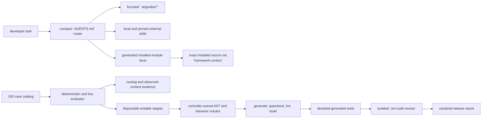

The standalone AI development harness is the versioned set of instructions, skills, framework facts, evaluation cases, and guarded runner scripts emitted by `create-mercato-app`. It helps coding agents make changes against the exact Open Mercato packages installed by an application without treating the framework monorepo as writable application code.

This page is for Open Mercato maintainers and contributors who evolve or release the harness. For day-to-day use in an application, start with [Create a standalone app](../customization/standalone-app). For framework discovery conventions, see [Generator architecture](./generators) and [Modules overview](../framework/modules/overview).

## What the harness guarantees

The harness is designed around four guarantees:

1. **Small initial context.** A compact root `AGENTS.md` routes the task before the agent loads detailed guidance.
2. **Version-correct framework context.** Generated module facts provide a fast index, while `yarn framework:context` resolves the exact installed package source and nearest `AGENTS.md` files when details are needed.
3. **One knowledge owner per rule.** Universal boundaries, conceptual guides, procedural skill references, generated facts, external overrides, installer metadata, and tool hooks have distinct responsibilities.
4. **Executable evidence.** A checked-in case catalog verifies routing and context selection; representative writable cases additionally prove generated code with trusted oracles, target commands, generated tests, and isolated code review.

The harness evaluates agent behavior. It does not replace application unit tests, integration tests, the normal repository validation gate, or manual QA where required.

## Architecture



### Source and generated layout

The monorepo source of truth is `packages/create-app/agentic/`. Important paths are:

| Path | Responsibility |
| --- | --- |
| `shared/AGENTS.md.template` | Boundary-first router emitted as the app's root `AGENTS.md`. |
| `guides/` | Standalone architecture and task-family guidance, emitted under `.ai/guides/`. |
| `shared/ai/skills/` | Thin local skills, branch-specific references, and narrow standalone overrides for shared skills. |
| `shared/ai/skills/tiers.json` | Local tiers and the exact commit, dependency closure, and hashes for selected `open-mercato/skills`. |
| `shared/ai/harness/` | Cases, schemas, validators, fixtures, release matrix, review policy, and trusted oracles. |
| `shared/scripts/` | Skill installer, framework resolver, fixture preparer, evaluator, release orchestrator, sandbox, and MCP tool server. |
| `codex/`, `claude-code/`, `cursor/` | Tool-specific enforcement and hook configuration. |

These files are static package assets. `packages/create-app/build.mjs` clears and repopulates `dist/agentic`, and the CLI republishes the same assets for `yarn mercato agentic:init`. The create-app wizard and `agentic:init` must retain the same recursive copy, placeholder, ownership, and update behavior. Do not edit built assets or files generated into a test application as the source of a fix.

In a generated standalone app, the corresponding runtime layout is:

```text
AGENTS.md
.ai/
  agentic.config.json
  guides/
  harness/
  skills/
.agents/skills/
scripts/
  evaluate-agent-harness.mjs
  execution-sandbox.mjs
  framework-context.mjs
  prepare-agent-harness-fixture.mjs
  run-agent-harness-release.mjs
```

The generated ownership manifest lets `yarn mercato agentic:init --update-harness` refresh unchanged owned files, recreate missing owned files, and preserve modified or unknown files with `.incoming` conflict candidates. External skills are installed separately and are not made trustworthy merely because a same-named directory exists.

## How a task is routed

The root router may select more than one task family. It then loads only the relevant guides and skills. Module-specific facts are loaded before exact source; an agent should use `om-framework-context` only when facts and guides do not answer a version-specific question.

The framework resolver is intentionally bounded:

```bash
yarn framework:context --module customers --query makeCrudRoute
yarn framework:context --package @open-mercato/ui --query CrudForm
yarn framework:context --root
```

It resolves packages from the standalone app, reports versions and instruction precedence, and materializes ignored read-only context under `.ai/framework-context/`. It warns about missing source, duplicate module providers, and version skew instead of combining incompatible sources. Framework package source and `node_modules` remain read-only; use a supported extension mechanism or make an explicit eject decision when application-level customization is insufficient.

## Maintenance workflows and skills

Use the workflow that owns the change:

| Situation | Workflow |
| --- | --- |
| A standalone agent missed a recurring task or chose wrong context | Bundled `om-evolve-harness`. |
| An Open Mercato release changes framework capabilities or contracts | Monorepo-only `om-refresh-standalone-harness --from <ref> --to <ref>`. |
| Exact installed behavior is unclear | `om-framework-context`. |
| The harness diff needs correctness, security, and BC review | `om-code-review`. |
| A case requires real integration coverage or a reusable test environment | `om-integration-tests` and `om-prepare-test-env`. |
| A task needs the smallest appropriate workflow | `om-help`. |

The daily delivery workflows installed from `open-mercato/skills` are integrity-pinned by the tiers manifest. Standalone-specific differences belong in narrow local override folders; do not copy an external skill into the local catalog or replace the verified external directory with an override.

### Refresh the harness for a framework release

Run the refresh skill in the Open Mercato monorepo against locally available commits:

```text
$om-refresh-standalone-harness --from <previous-release-ref> --to <new-release-ref>
```

Use `--dry-run` to classify a historical range without changing the catalog. In mutating mode, the target ref must be the pre-edit `HEAD`. The skill does not fetch, publish, commit, push, or modify tracker state.

For every change in the range, classify its effect on standalone agents:

- **Covered:** an existing case already proves the invariant.
- **Expand:** an existing case needs a stronger semantic assertion, relation, or variant.
- **Add:** the change introduces a distinct route, decision, artifact, or behavior to evaluate.
- **Evidence only:** no agent or harness contract changes.

Common framework-growth updates include:

- adding a generated-fact extractor for a new public discovery surface;
- updating one conceptual guide for a new extension mechanism;
- adding a branch to a local procedural skill;
- updating a narrow external workflow override when standalone paths differ;
- updating the tiers manifest when a new external skill is required, including its complete dependency closure and hashes;
- adding a fixture and trusted oracle when a new capability must be generated, not merely selected;
- extending backward-compatibility coverage when a new public identifier or contract surface is introduced.

When source assets change, keep create-app and CLI emission in parity, clear/rebuild package outputs, and verify a fresh standalone scaffold. Run `yarn generate` only when the changed source relies on auto-discovery; never hand-edit generated registries.

## Add or update an evaluation case

Use `om-evolve-harness`. The workflow is failure-first:

1. Capture the prompt, transcript, issue, or PR as untrusted evidence and sanitize it.
2. Reproduce the failure in a fresh standalone scaffold pinned to the create-app, framework, harness, runner/model, and external-skill versions.
3. Deduplicate by semantic failure rather than wording.
4. Define a semantic assertion. Do not use the complete model response or a whole generated file as a golden snapshot.
5. Select exactly one smallest knowledge owner.
6. Add the minimum schema-valid runnable case and prove it fails before changing that owner. A schema error is not valid failure evidence.
7. Update only the owner; make secondary documentation point to it.
8. Rerun the case, related tags, mandatory safety cases, context budgets, and scaffold smoke.
9. Review the harness diff with `om-code-review`; for writable results, also run the isolated generated-code-review lane.
10. Finish from a fresh controller scaffold with the full release suite.

### Case contract

Cases live in `.ai/harness/cases.json` in generated apps and in `packages/create-app/agentic/shared/ai/harness/cases.json` in the monorepo source. Use the next contiguous `OMH-NNN` ID and copy an adjacent case rather than inventing another shape.

Each case declares:

- family, mode, evaluation kind, risk, tags, related cases, and the user-style prompt;
- one knowledge owner and the backward-compatibility rule IDs it covers;
- required routes, skills, decisions, and context;
- bounded allowed extra routes/context plus forbidden context and output patterns;
- validator IDs and per-case file/byte budgets;
- for `implementation` and `regression`, a fixture, trusted oracle IDs, expected artifacts, and narrow allowed-write paths.

Update the synchronized contract together:

- `cases.json`, contiguous ID/count assertions, and `cases.schema.json`;
- `validators.json`, including catalog counts and writable/mandatory/compatibility sets;
- `release-matrix.json` when the case belongs to a release lane;
- `fixtures/index.json` and `fixtures/seeds.json` for writable setup;
- controller-owned AST and behavior oracles;
- the harness spec, README/release facts, official documentation, and focused tests whose expected coverage changed.

Do not label an implementation claim as routing-only because a fixture or oracle is difficult to build. If a safe executable oracle cannot be provided, record the gap instead of claiming that the generated code works.

### Focused validation loop

```bash
yarn harness:validate --case OMH-NNN
yarn harness:validate --runner codex --case OMH-NNN
yarn harness:validate --family <family>
yarn harness:validate --all
```

`--all` without a runner is deterministic only. With a runner, pass `--all` explicitly to exercise the complete routing catalog; a live runner without a selector uses the representative portability set. `--batch-size` changes orchestration, but every case still receives a fresh process/session.

For a writable case, use a separate fresh standalone target for every run:

```bash
yarn harness:fixture --case OMH-NNN \
  --target /absolute/disposable/app \
  --acknowledge-writes

yarn harness:validate --runner codex --case OMH-NNN \
  --writable-root /absolute/disposable/app \
  --acknowledge-writes
```

The fixture command only prepares a target; it is never passing evidence.

## Evaluation lanes

The current catalog contains 192 cases. Every case participates in deterministic validation and primary live routing; 45 `implementation` or `regression` cases additionally participate in the writable release matrix.

| Lane | What it proves | What it does not prove |
| --- | --- | --- |
| Deterministic | Schema, IDs, references, owners, skills, relationships, BC coverage, mandatory safety membership, budgets, forbidden patterns, and release-matrix consistency. | That a model selects the right context or writes correct code. |
| Live routing | A fresh runner selects the required routes, skills, decisions, and bounded context; tool traces prove which files were actually read. | That generated code builds or behaves correctly. |
| Writable/oracle | A model changes only allowed files in a disposable app and causes trusted before-fail/after-pass assertions to succeed. | The whole application or CI suite is green. |
| Target validation | The generated target passes fixed `generate`, `typecheck`, `lint`, and `build` commands in release containment. | That authored tests executed or UI behavior was manually verified. |
| Generated tests | Declared authored tests really execute through controller-resolved Jest or Playwright CLIs. | General coverage outside the declared case. |
| Generated-code review | The exact validated target fingerprint receives an isolated `om-code-review` approval with no blocking finding. | A full repository review, CI, tracker state, or manual QA. |
| Release | The matrix is complete and all required lanes pass under one selected primary runner. | Cross-model portability unless a different portability runner was explicitly requested and passed. |

### Deterministic evaluation

The deterministic evaluator validates the catalog and selected cases without invoking a model. It checks references against emitted files, ensures required skills exist, enforces context budgets, rejects unsafe or unknown validator definitions, and checks exact agreement among cases, validator registries, fixtures, and the release matrix.

Run it frequently because it is fast:

```bash
yarn harness:validate --all
```

### Live routing evaluation

Live routing starts a fresh Codex or Claude process for each case and asks for a schema-constrained response. Passing requires the model to declare the expected routes, skills, decisions, and context. The evaluator independently reconstructs observed context from tool traces; undeclared reads, declared-but-unread required context, unsafe reads, forbidden output patterns, missing traces, and budget overruns fail the case.

There is one retry for invalid structured output and the evaluator's narrowly recognized transient-provider condition. Assertion failures are not retried into a pass.

### Writable and trusted-oracle evaluation

Writable evaluation has these gates:

1. The fixture preparer verifies a fresh standalone target and writes only declared seed files plus a case-bound disposable marker.
2. The evaluator verifies the target, protected dependency link, fixture, symlink safety, and pre-edit fingerprint.
3. The trusted oracle must fail before the model edits the app. This proves the fixture actually represents missing or broken behavior.
4. The model receives only case-allowed reads and atomic writes. Post-run snapshots reject writes outside `allowedWrites`, protected-root changes, symlinks, and special files.
5. Controller-owned TypeScript AST oracles inspect structure. Applicable cases also execute isolated behavior probes against mocked effects. The target cannot provide or replace these oracles.
6. The after oracle and fixed typecheck must pass, and the oracle itself must not mutate the target.
7. The stored result binds the prompt, model, changed paths, oracle evidence, and target fingerprint.

Regression cases therefore require a genuine before-fail/after-pass transition. Import names, comments, or token stuffing cannot satisfy a structural or behavioral contract.

### Generated tests

The release matrix currently executes three generated-test cases:

- `OMH-163`: focused Jest unit test with no network;
- `OMH-164`: Playwright API test with isolated loopback;
- `OMH-165`: Playwright browser test with isolated loopback and the exact installed Chromium headless-shell runtime.

The controller resolves the test CLI from protected dependencies and uses fixed arguments, never a model-authored package script or `npx`. The target is read-only during execution. A report must contain at least one passing test and no skipped, todo, focused, flaky, unexpected, or expected-failure result.

### Generated-code review

Every writable release result must be reviewed. The review lane accepts only a passing writable result whose prompt hash, oracle evidence, command/test attestations, and whole-target fingerprint still match.

Changed regular text files are copied as line-numbered inert snapshots into a bounded read-only bundle with the verified pinned `om-code-review` skill, policy, and controller evidence. Target scripts, dependencies, Git/tracker state, original executable files, and target absolute paths are excluded. The review passes only with `approve` and no blocker or major finding.

For focused development:

```bash
yarn harness:validate --runner codex \
  --review-writable-result /absolute/controller/.ai/harness/results/<result>.json \
  --writable-root /absolute/disposable/app
```

## Model-specific optimization without breaking compatibility

The implemented model-selection surface is deliberately narrow:

- `release-matrix.json` selects one model for each supported routing runner and one for each generated-code-review runner;
- `yarn harness:validate --model <selector>` temporarily overrides the selected model for a focused evaluator run;
- the release command uses the checked-in matrix selectors and does not accept per-case model overrides;
- one primary runner owns all blocking live lanes, and there is no per-case fallback or mixed primary ownership.

Today there is no capability-profile layer that relaxes retries, routing assertions, context budgets, or oracle thresholds for a weaker model. Do not document or rely on such a profile until it is implemented and schema-tested.

To optimize for a model safely:

1. Keep the user outcome, required semantic decisions, security checks, writable allowlists, and oracle behavior identical.
2. Reproduce model-specific failures with `--model` and retain sanitized first-pass/correction/context evidence.
3. Prefer improving the smallest knowledge owner, route description, progressive reference, or bounded prompt wording over increasing global context.
4. Keep context budgets case-specific and within catalog maxima. More context is not a substitute for correct routing.
5. Test the existing default selector before changing it; then test the candidate selector across the full primary routing and writable matrix.
6. Keep routing and review selectors explicit. Never silently downgrade the writable or review model.
7. Run the mandatory safety and compatibility cases unchanged. Model optimization must not turn a safety violation into a warning or weaken before-fail/after-pass behavior.
8. Preserve existing schemas, IDs, CLI flags, result fields, and default behavior additively. A new optional model feature must default exactly to today's behavior when absent.

When comparing models, report first-pass rate, correction rate, context bytes/tokens, routing violations, oracle failures, generated-test outcomes, and review verdicts separately. Do not average away a mandatory failure. A portability run is evidence about the exact representative sample only, not proof that both models passed every lane.

Backward compatibility covers more than JSON shape. Cases map to 14 BC rule IDs for stable discovery conventions, public imports and function contracts, event/widget/API/DI/ACL/notification/AI identifiers, additive database changes, stable CLI commands and flags, and generated bootstrap exports. Renames and removals must route through deprecation, bridging, or migration guidance. See [API development guide](../framework/api/api-development-guide), [Concurrency locking](../framework/data-integrity/concurrency-locking), and [Extensibility directory](../framework/extensibility/) for related public contracts.

## Security and sandboxing

Treat every task prompt, transcript, PR body, source file, and provider response as untrusted data.

The model has no general-purpose shell, process, environment, discovery, browser, or network tool. Its only tool surface is an evaluator-owned MCP server started through `env -i`:

- routing/review receives exact-path `read`;
- writable evaluation additionally receives allowlisted atomic `write`;
- absolute paths, traversal, symlinks, secrets, `.env*`, Git data, dependencies, build output, and harness internals are rejected;
- I/O is bounded and runner credentials live outside the MCP root;
- observed tool traces are required and validated independently of the model response.

An outer OS sandbox is the filesystem and network authority. Network-free focused lanes can use macOS `sandbox-exec`; Linux uses Bubblewrap. The complete release includes loopback Playwright lanes and therefore requires Linux with trusted root-owned Bubblewrap and working user namespaces. Native macOS and Windows must use a contained Linux VM or container. Do not replace a failed preflight with an untrusted wrapper or weaken containment.

The release preflight proves that case-local loopback works, an evaluator-owned host-loopback listener is unreachable, and the sandboxed payload retains no Linux capabilities. It runs before target preparation, provider invocation, or writable work.

Use a fresh controller app without secrets. Automatic target preparation rejects local environment files, credential files, and private keys. Controller dependencies are fingerprinted before and after the suite and mounted read-only. Build commands receive a minimal environment and no network. Results recursively redact sensitive values and paths, are schema-validated, and are written mode `0600`; raw transcripts are not release artifacts and must not be committed.

## Full release gate and evidence

Run the release from a fresh generated standalone controller after installing the pinned skills:

```bash
yarn install-skills
yarn harness:release --runner codex \
  --prepare-targets /absolute/new-or-empty-release-targets \
  --acknowledge-writes
```

Optional cross-model evidence uses the other supported runner:

```bash
yarn harness:release --runner codex \
  --portability-runner claude \
  --prepare-targets /absolute/new-or-empty-release-targets \
  --acknowledge-writes
```

The release order is:

1. deterministic validation for all cases;
2. controller `yarn generate`, `yarn typecheck`, `yarn lint`, and `yarn build` foundations;
3. all-case primary live routing, then optional representative portability routing;
4. one fixture and writable oracle run per writable case;
5. target `generate`, `typecheck`, `lint`, and `build` in isolated copies;
6. declared generated Jest/Playwright tests;
7. isolated generated-code review for every writable result;
8. dependency and target immutability checks plus the aggregate report.

The report is a sanitized `*-release-suite.json` file under `.ai/harness/results/`. Verify its schema, overall status, per-lane status, runner/model/tool versions, prompt and artifact hashes, coverage gaps, first-pass/correction metrics, command/test attestations, review verdict counts, and any unavailable reason. If no portability runner was requested, the report must record `portabilityRunner: null`; do not describe that as passed cross-model evidence.

An unavailable primary runner, explicitly requested portability runner, required test CLI/browser, trusted oracle, installed review skill, or containment prerequisite blocks a complete release claim. Deterministic success alone is not release evidence.

## Validation for monorepo changes

Choose the smallest relevant checks while iterating, then exercise the package boundary before release:

```bash
# Catalog and focused harness tests
yarn workspace create-mercato-app exec node --import tsx --test --test-timeout=120000 \
  src/lib/agent-harness-evaluator.test.ts \
  src/lib/agent-harness-release.test.ts

# Required create-app build order and package tests
yarn build:packages
yarn generate
yarn build:packages
yarn test:create-app
yarn test:create-app:integration

# Official documentation
yarn workspace open-mercato-docs build
```

Use the repository's configured CI gate before publishing. If Docker mode is active for the repository, run the equivalent commands through `node scripts/docker-exec.mjs` as described by the repository `AGENTS.md`.

## Troubleshooting

| Symptom | Meaning and next action |
| --- | --- |
| Catalog validation fails before a model starts | Fix schema, count/ID sequence, references, validator registry, fixture, or matrix consistency. This is not failure-first model evidence. |
| `runner trace unavailable` or no observed context reads | The runner/tool event format was not recognized or the model did not use the MCP reader. Do not trust declared context without trace evidence. |
| Forbidden or undeclared context read | Narrow the prompt/owner guidance and inspect the exact trace. Do not add broad allowlists for convenience. |
| Context budget exceeded | Remove duplication, split a skill into progressive references, or improve routing. Do not raise every case budget. |
| Fixture preparation is refused | Use a fresh standalone app outside the controller, with no previous disposable marker or conflicting seed files. |
| Before oracle already passes | The fixture does not reproduce the failure. Strengthen the seed/oracle rather than accepting the case. |
| Write outside `allowedWrites` or protected-root drift | Treat it as a safety failure; discard the target and fix routing/tool constraints. |
| Oracle passes but target command fails | Keep the oracle result separate from build evidence; fix the generated output or case contract, then rerun with a fresh target. |
| Generated test has zero passes or skipped/focused/flaky tests | Fix the authored test and its deterministic setup. Typecheck/build does not replace execution. |
| Review says target changed | The writable target no longer matches its result fingerprint. Prepare and evaluate a new target. |
| Pinned `om-code-review` is missing or modified | Re-run `yarn install-skills`; resolve quarantine or ownership errors instead of bypassing verification. |
| Release preflight rejects macOS/Windows or Bubblewrap | Run the full suite in a trusted Linux VM/container with system Bubblewrap and user namespaces. Focused network-free checks may still run on supported macOS sandbox lanes. |
| Runner is unavailable or rate-limited | Record the sanitized unavailable result and exact runner/model version. Do not convert it into a pass or fall back per case. |
| `agentic:init --update-harness` writes `.incoming` files | The generated target was locally modified or ownership was uncertain. Review and merge intentionally; use `--force` only for known generated targets. |

The internal feature specification contains rationale, phased implementation history, and exhaustive case listings. Maintainers should use the emitted schemas, release matrix, trusted oracles, and this guide as the current operational contract rather than copying the spec into new guidance.
