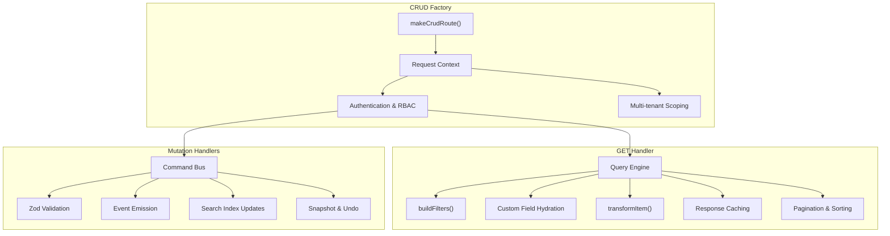

# CRUD API Factory

The CRUD factory (`makeCrudRoute`) is a powerful abstraction for building consistent, multi-tenant safe REST APIs. It integrates deeply with the open-mercato architecture to provide validation, security, performance, and extensibility.

## Architecture Overview



## Core Configuration

### ORM Configuration

```ts
const crud = makeCrudRoute({
  orm: {
    entity: CustomerEntity, // MikroORM entity class
    idField: "id", // Primary key field (default: 'id')
    orgField: "organizationId", // Organization scope field (default: 'organizationId')
    tenantField: "tenantId", // Tenant scope field (default: 'tenantId')
    softDeleteField: "deletedAt", // Soft delete field (default: 'deletedAt')
  },
  // ... rest of config
});
```

**Field Behavior:**

- `orgField: null` disables automatic organization scoping
- `tenantField: null` disables automatic tenant scoping
- `softDeleteField: null` disables implicit soft delete filtering

## Usage

Define a `route.ts` under `packages/<pkg>/src/modules/<module>/api/<path>/route.ts` (or `apps/mercato/src/modules/<module>/api/<path>/route.ts` for app overrides) and use the factory.

### Modern Pattern (with Commands)

The recommended approach is to delegate mutations to [Commands](../commands/overview) and use the factory primarily for the `GET` (list) handler and wiring.

```ts title="packages/<pkg>/src/modules/example/api/todos/route.ts"
import { z } from "zod";
import { makeCrudRoute } from "@open-mercato/shared/lib/crud/factory";
import { TodoEntity } from "../../data/entities";
import { E } from "@/generated/entities.ids.generated";

const querySchema = z.object({
  page: z.coerce.number().min(1).default(1),
  pageSize: z.coerce.number().min(1).max(100).default(50),
  search: z.string().optional(),
});

const routeMetadata = {
  GET: { requireAuth: true, requireFeatures: ["example.todos.view"] },
  POST: { requireAuth: true, requireFeatures: ["example.todos.create"] },
  PUT: { requireAuth: true, requireFeatures: ["example.todos.edit"] },
  DELETE: { requireAuth: true, requireFeatures: ["example.todos.delete"] },
};

export const metadata = routeMetadata;

const crud = makeCrudRoute({
  metadata: routeMetadata,
  orm: {
    entity: TodoEntity,
    // defaults: idField: 'id', orgField: 'organizationId', tenantField: 'tenantId'
  },
  list: {
    schema: querySchema,
    entityId: E.example.todo,
    fields: ["id", "title", "status", "cf:priority"],
    sortFieldMap: { priority: "cf:priority" },
    buildFilters: async (query, ctx) => {
      // Return typed filters for QueryEngine
      const filters: any = {};
      if (query.search) filters.title = { $ilike: `%${query.search}%` };
      return filters;
    },
  },
  actions: {
    create: {
      commandId: "example.todos.create",
      schema: z.object({ title: z.string() }).passthrough(), // validation handled by command
    },
    update: {
      commandId: "example.todos.update",
    },
    delete: {
      commandId: "example.todos.delete",
    },
  },
});

export const { GET, POST, PUT, DELETE } = crud;
```

## Configuration Options

### `orm`

Configures the MikroORM entity binding.

- `entity`: The entity class.
- `idField`: Primary key field (default: `'id'`).
- `orgField`: Field for organization scope (default: `'organizationId'`). Pass `null` to disable.
- `tenantField`: Field for tenant scope (default: `'tenantId'`). Pass `null` to disable.
- `softDeleteField`: Field for soft deletes (default: `'deletedAt'`).

### List Configuration Deep Dive

The `list` configuration powers the GET endpoint using the Query Engine for advanced querying capabilities.

#### Basic List Configuration

```ts
list: {
  schema: z.object({
    page: z.coerce.number().min(1).default(1),
    pageSize: z.coerce.number().min(1).max(100).default(50),
    search: z.string().optional(),
    status: z.enum(['active', 'inactive']).optional(),
    createdFrom: z.string().optional(),
    createdTo: z.string().optional(),
    sortField: z.string().optional(),
    sortDir: z.enum(['asc', 'desc']).optional(),
  }),
  entityId: E.customers.customer_entity,
  fields: [
    'id',
    'display_name',
    'primary_email',
    'status',
    'created_at',
    'cf:priority',    // Custom field
    'cf:tags',        // Another custom field
  ],
}
```

#### Default and tiebreak sorting

When a request carries no `sortField` / `sort` param the factory sorts by `id` ascending. That is only a meaningful order for sequential ids — entities with `defaultRaw: 'gen_random_uuid()'` primary keys get an arbitrary order that changes every time the rows are rewritten. Set `defaultSort` to pick the column that actually carries the domain's ordering, and `tiebreakSortField` to keep rows with equal primary values stable across pages and re-fetches:

```ts
list: {
  schema: listSchema,
  entityId: E.sales.sales_order_line,
  fields: lineFields,
  sortFieldMap: { lineNumber: 'line_number', createdAt: 'created_at' },
  defaultSort: { field: 'lineNumber', dir: 'asc' },
  tiebreakSortField: 'id',
}
```

Notes:

- Both options are resolved through `sortFieldMap`: name the public alias when the map defines one (`lineNumber`), and an unmapped name is used as the column directly (which is why `tiebreakSortField: 'id'` works above without an `id` entry in the map).
- **Both apply to the Query Engine path only** — the route must set `entityId` *and* `fields`. The plain-ORM fallback list issues an unordered `find` and already ignores `sortField` today, so a route configured without `entityId`/`fields` will set `defaultSort` and observe no ordering at all.
- `defaultSort.dir` applies only together with `defaultSort.field`. An explicit `sortField` without a `sortDir` still defaults to ascending.
- The list schema must keep `sortField` **optional**. A zod `.default()` on `sortField` reaches the sort resolver as an explicit request and pins the order itself, so `defaultSort` never takes effect.
- `tiebreakSortField` is appended as a secondary ascending sort only when it differs from the resolved primary sort, and it applies to explicit sorts too.

#### Per-request projection (function-form `fields`)

`fields` accepts either a static array or a function `(query, ctx) => string[]` that resolves the projection per request. The function form lets a route narrow the columns the Query Engine selects based on the validated query — most usefully to drop large detail-only columns (encrypted JSONB snapshots, payload blobs) from grid listings while still selecting them for single-record fetches.

This matters because those columns are fetched over the wire **and decrypted per row** for every list page even when no grid column renders them; the cost scales with row width × page size.

```ts
const detailOnlyColumns = new Set([
  'billing_address_snapshot',
  'shipping_address_snapshot',
  'totals_snapshot',
  'metadata',
]);

const allFields = ['id', 'number', 'status', 'customer_snapshot', ...detailOnlyColumns];
const gridFields = allFields.filter((field) => !detailOnlyColumns.has(field));

list: {
  schema: listSchema,
  entityId: E.sales.sales_order,
  // The detail page fetches a single record through this same list route with an
  // `?id=` filter (there is no separate detail endpoint), so it needs the full
  // projection. Grid listings (no `id`) use the trimmed projection.
  fields: (query) =>
    typeof query.id === 'string' && query.id.length ? allFields : gridFields,
}
```

Notes:

- The function is resolved on the Query Engine path only (the route must set both `entityId` and `fields`). The array form is fully backward compatible — pass an array whenever the projection is static.
- Keep response keys stable. Dropped columns still serialize (e.g. as `null` via `transformItem`), so the wire contract / OpenAPI schema stays unchanged as long as those response fields are already `nullable().optional()`.
- Only narrow columns the list view never renders. Keep any column the grid derives a displayed value from (for sales documents, `customer_snapshot` is kept because the grid renders the customer name/email from it).

#### Advanced Filtering with `buildFilters`

The `buildFilters` function transforms query parameters into Query Engine compatible filters:

```ts
buildFilters: async (query, ctx) => {
  const filters: Record<string, any> = {};

  // Basic field filters
  if (query.status) {
    filters.status = { $eq: query.status };
  }

  // Text search with ILIKE
  if (query.search) {
    filters.display_name = { $ilike: `%${query.search}%` };
  }

  // Date range filters
  if (query.createdFrom || query.createdTo) {
    const range: any = {};
    if (query.createdFrom) range.$gte = new Date(query.createdFrom);
    if (query.createdTo) range.$lte = new Date(query.createdTo);
    filters.created_at = range;
  }

  // Custom field filters (requires EM access)
  if (ctx) {
    const cfFilters = await buildCustomFieldFiltersFromQuery({
      entityIds: [E.customers.customer_entity],
      query,
      em: ctx.container.resolve("em"),
      tenantId: ctx.auth?.tenantId ?? null,
    });
    Object.assign(filters, cfFilters);
  }

  return filters;
};
```

**Supported Filter Operators:**

- `$eq` - Equal
- `$ne` - Not equal
- `$gt`, `$gte` - Greater than
- `$lt`, `$lte` - Less than
- `$in` - In array
- `$nin` - Not in array
- `$ilike` - Case-insensitive LIKE
- `$exists` - Field exists/null check

#### Custom Field Sources

For entities with custom fields in related tables:

```ts
customFieldSources: [
  {
    entityId: E.customers.customer_person_profile,
    table: "customer_people", // Table name
    alias: "person_profile", // Join alias
    recordIdColumn: "id", // Column in main table
    join: {
      fromField: "id", // Field in main table
      toField: "entity_id", // Field in joined table
    },
  },
];
```

#### Complex Joins

Define multi-table relationships:

```ts
joins: [
  {
    alias: "tag_assignments",
    table: "customer_tag_assignments",
    from: { field: "id" },
    to: { field: "entity_id" },
    type: "left", // 'left', 'inner', 'right'
  },
  {
    alias: "tags",
    table: "customer_tags",
    from: { field: "tag_assignments.tag_id" },
    to: { field: "id" },
    type: "left",
  },
];
```

#### Item Transformation

Post-process query results:

```ts
transformItem: (item) => {
  // Remove sensitive fields
  const { password, ...safe } = item;

  // Add computed fields
  return {
    ...safe,
    displayName: item.first_name + " " + item.last_name,
    isOverdue: item.due_date && new Date(item.due_date) < new Date(),
  };
};
```

#### Export Configuration

Enable CSV/JSON/XML export:

```ts
export: {
  enabled: true,
  formats: ['csv', 'json', 'xml'],
  filename: 'customers_export',
  columns: [
    { field: 'id', header: 'ID' },
    { field: 'display_name', header: 'Name' },
    { field: 'cf:priority', header: 'Priority' },
  ],
  batchSize: 1000,  // Process in batches for large exports
}
```

### Actions Configuration (Command Integration)

The `actions` configuration integrates with the Command Bus for business logic execution:

```ts
actions: {
  create: {
    commandId: 'customers.people.create',
    schema: z.object({}).passthrough(), // Validation before command
    mapInput: async ({ parsed, raw, ctx }) => {
      // Transform input before command execution
      const { translate } = await resolveTranslations()
      const scoped = withScopedPayload(raw, ctx, translate)
      const { base, custom } = splitCustomFieldPayload(scoped)
      return Object.keys(custom).length ? { ...base, customFields: custom } : base
    },
    response: ({ result }) => ({
      id: result?.entityId ?? result?.id ?? null,
      personId: result?.personId ?? null,
    }),
    status: 201,
  },
  update: {
    commandId: 'customers.people.update',
    schema: z.object({ id: z.string().uuid() }).passthrough(),
    mapInput: async ({ parsed, raw, ctx }) => {
      const { translate } = await resolveTranslations()
      const scoped = withScopedPayload(raw, ctx, translate)
      const { base, custom } = splitCustomFieldPayload(scoped)
      return Object.keys(custom).length ? { ...base, customFields: custom } : base
    },
    response: () => ({ ok: true }),
  },
  delete: {
    commandId: 'customers.people.delete',
    mapInput: ({ parsed }) => ({ id: parsed.id }),
    response: () => ({ ok: true }),
  },
}
```

#### Command Integration Benefits

1. **Transactional Consistency** - Commands handle all business logic in transactions
2. **Audit Logging** - Automatic operation logging with undo support
3. **Event Emission** - Commands emit events for side effects
4. **Search Indexing** - Automatic index updates
5. **Undo Support** - Full snapshot-based undo capabilities

### `events` & `indexer`

Controls side effects when **not** using Commands (Commands handle this internally).

- `events`: Emit standard `<module>.<entity>.<action>` events.
- `indexer`: Emit `query_index` events to keep the search index in sync.

## Hooks

Lifecycle hooks allow injecting logic before/after operations.

```ts
hooks: {
  beforeList: async (query, ctx) => { /* ... */ },
  afterList: async (response, ctx) => { /* ... */ },
  beforeCreate: async (input, ctx) => { /* ... */ },
  afterCreate: async (entity, ctx) => { /* ... */ },
  // ... update/delete hooks
}
```

## Response Caching

The CRUD factory includes sophisticated caching to improve performance:

### Cache Configuration

```ts
// Environment variables
ENABLE_CRUD_API_CACHE = true; // Enable caching globally
OM_CRUD_CACHE_DEBUG = true; // Debug cache hits/misses
```

### Cache Key Generation

Cache keys include:

- Resource path (`/api/customers/people`)
- Query parameters (sorted and serialized)
- Tenant ID
- Selected organization ID
- Organization scope (array of allowed org IDs)
- Caller identity (`user:` segment — the API key id, or the user id for session callers)
- Active-enricher signature (only when the route has enrichers active for the caller)

```ts
// Example cache key structure
crud|customers.customer_entity|GET|/api/customers/people|tenant:123|selectedOrg:456|scope:456,789|user:abc|query:page=1&pageSize=50&search=test
```

Entries are never shared across caller identities: `buildFilters`, interceptor
query rewrites, and `afterList`/after-interceptor output can all vary per user,
and the stored payload embeds them.

### Response Enrichers and the List Cache

When a route opts into [response enrichers](/framework/widget-injection#umes-phase-d--response-enrichers), the cache stores the enriched payload and appends an `enrichers:<signature>` segment to the key, derived from the enrichers active for the caller after ACL + tenant filtering. This partitions entries by feature cohort, so a caller never receives ACL-gated fields enriched for a different cohort.

On a cache hit the factory re-runs the active enrichers **unless every one of them sets `cacheableOnListHit: true`** — in which case the stored enriched fields are served directly (the fast path). Non-cacheable enrichers (cross-module reads, time-relative values, cross-table aggregates) keep re-running on every hit so the response stays fresh, and for those routes the cache stores the base pre-enrichment payload. See the [`cacheableOnListHit` guidance](/framework/widget-injection#list-cache-interaction-cacheableonlisthit) for when to opt in.

### Automatic Invalidation

Cache invalidation happens automatically when:

- Mutations occur via commands (CREATE, UPDATE, DELETE)
- Events are emitted with entity identifiers
- Cache tags match the mutated resource

### Cache Headers

Responses include cache status headers:

- `x-om-cache: hit|miss` - Cache status
- `x-om-partial-index` - Partial index warnings (JSON)

## Performance Features

### Profiling

Enable profiling for performance analysis:

```bash
# Enable profiling for all operations
OM_PROFILE=*

# Profile specific modules
OM_PROFILE=customers.*

# Profile CRUD operations only
OM_CRUD_PROFILE=true
```

### Query Optimization

The factory automatically:

- Uses Query Engine for complex queries (avoids N+1 problems)
- Implements cursor-based pagination
- Supports batch export operations
- Caches custom field definitions
- Parallelizes custom field loading

Routes can further trim per-request work by passing a [function-form `fields`](#per-request-projection-function-form-fields) projection that drops large detail-only columns from grid listings, avoiding fetching and decrypting blobs the list never renders.

### Export Performance

For large datasets, exports use:

- Batch processing (default: 1000 records)
- Configurable batch sizes
- Memory-efficient streaming
- Background processing for very large exports

## Event System Integration

### Automatic Events

When using commands, events are emitted automatically:

- `customers.person.created`
- `customers.person.updated`
- `customers.person.deleted`

### Indexer Integration

Search index updates are handled automatically:

- Creates `query_index` events
- Supports partial index detection
- Updates related entities (e.g., when deleting a person, updates deal indexes)

## Security & Multi-tenancy

### Authentication & Authorization

```ts
metadata: {
  GET: {
    requireAuth: true,
    requireFeatures: ['customers.people.view'],
    requireRoles: ['admin'],  // Optional role requirements
  },
  POST: {
    requireAuth: true,
    requireFeatures: ['customers.people.create'],
  },
  // ...
}
```

### Organization Scoping

The factory automatically:

- Resolves organization context from authentication
- Applies organization filters to queries
- Validates organization access for mutations
- Supports cross-organization queries (admin only)

### Tenant Isolation

- **Hard requirement**: All queries must specify `tenantId`
- **Automatic scoping**: Tenant filters applied to all operations
- **Validation**: Commands validate tenant access

## Error Handling

### Built-in Error Types

- `CrudHttpError` - Structured API errors
- Zod validation errors - Automatic 400 responses
- Database constraint errors - Converted to user-friendly messages
- Authentication errors - 401 responses
- Authorization errors - 403 responses

### Error Response Format

```json
{
  "error": "Validation failed",
  "details": [
    {
      "field": "email",
      "message": "Invalid email format"
    }
  ]
}
```

## Hooks System

Lifecycle hooks allow injecting custom logic:

```ts
hooks: {
  beforeList: async (query, ctx) => {
    // Pre-processing query
    console.log('Listing with filters:', query)
  },
  afterList: async (response, ctx) => {
    // Post-processing response
    response.items.forEach(item => {
      item.processed = true
    })
  },
  beforeCreate: async (input, ctx) => {
    // Validate business rules
    if (input.priority === 'high' && !ctx.auth.roles.includes('manager')) {
      throw new CrudHttpError(403, { error: 'Insufficient permissions for high priority' })
    }
    return { ...input, createdBy: ctx.auth.sub }
  },
  afterCreate: async (entity, ctx) => {
    // Side effects
    await sendNotification(ctx.container, 'Task created', entity)
  },
  // Similar for update/delete
}
```

## Testing

### Unit Testing Commands

```ts
describe("customers.people.create", () => {
  it("creates person with custom fields", async () => {
    const { result } = await executeCommand("customers.people.create", {
      displayName: "John Doe",
      primaryEmail: "john@example.com",
      "cf:department": "Engineering",
    });

    expect(result.entityId).toBeDefined();
  });
});
```

### API Integration Testing

```ts
describe("GET /api/customers/people", () => {
  it("returns paginated results", async () => {
    const response = await app.request(
      "/api/customers/people?page=1&pageSize=10"
    );
    expect(response.status).toBe(200);

    const data = await response.json();
    expect(data.items).toHaveLength(10);
    expect(data.total).toBeGreaterThan(10);
  });
});
```

## Custom Fields

The factory seamlessly integrates with the EAV system:

1.  **Reads**: `list.fields` can include `cf:<key>` to fetch values. `customFieldSources` allow fetching fields from related profiles.
2.  **Writes**: Use `parseWithCustomFields` and `setCustomFieldsIfAny` helpers inside your command.
