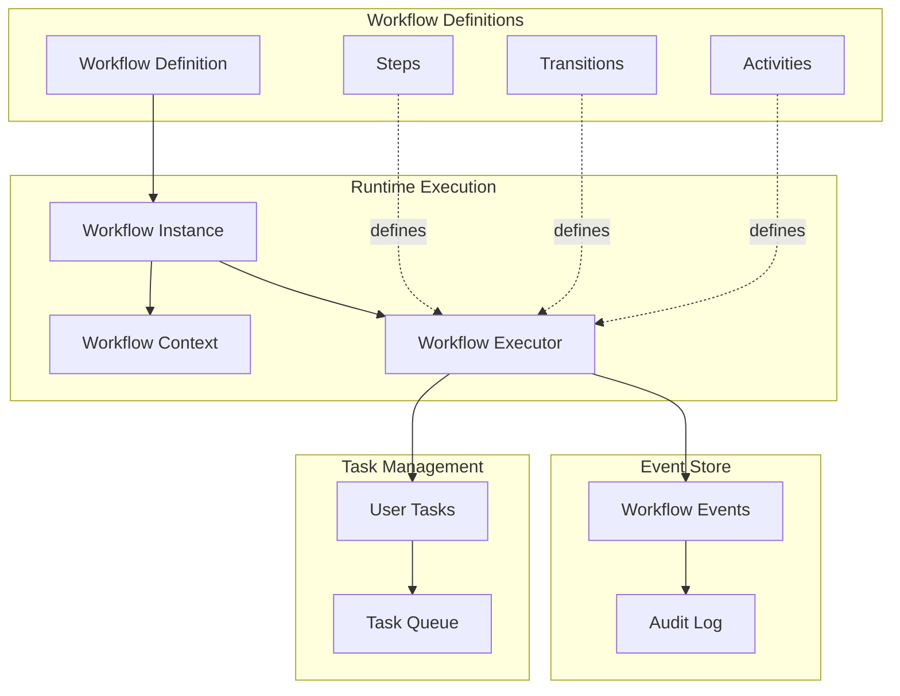
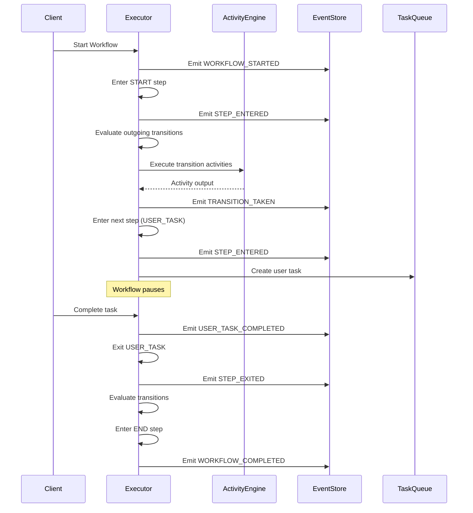
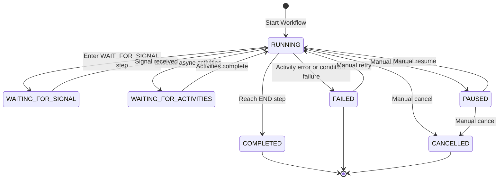

# Workflow Architecture

The workflow engine is a state machine orchestrator built for reliability, auditability, and extensibility. This guide explains the system design, core components, and architectural decisions.

## System Overview

The workflow engine manages long-running business processes through a state machine model. It coordinates steps, transitions, activities, and human interactions while maintaining complete audit trails through event sourcing.

**Key Design Principles:**
- **Event Sourcing**: Every state change is recorded as an immutable event
- **Compensation**: Automatic rollback on failure (saga pattern)
- **Async Activities**: Queue-based execution for long-running tasks
- **Multi-Tenancy**: Complete tenant and organization isolation
- **Extensibility**: Plugin architecture for custom activities and step handlers

## Core Components



### Workflow Definition

A workflow definition is a template that describes the process structure:

- **Steps**: Nodes in the state machine (START, END, USER_TASK, AUTOMATED, etc.)
- **Transitions**: Edges connecting steps with conditions and activities
- **Activities**: Actions that execute during steps or transitions
- **Metadata**: ID, version, name, description, active status

Multiple versions of the same `workflowId` coexist, and a `WorkflowInstance` pins the definition **record** it started on — the engine re-reads that record on every advance.

That makes a definition record editable but not freely so. `PUT /api/workflows/definitions/[id]` refuses a **structural** change while instances are still executing against it, and answers `409` with `code: WORKFLOW_STRUCTURAL_EDIT_REQUIRES_NEW_VERSION` plus the count of active instances, naming the publish endpoint as the remedy. The decision lives in the pure `lib/definition-edit-safety.ts`:

- **Structural** = step ids, step types, fork/join wiring, and transition ids, endpoints or `kind`.
- **Not structural** = labels, positions, activity config, conditions, priorities, triggers and metadata — these always save in place.
- **Active** = `RUNNING`, `PAUSED`, `WAITING_FOR_ACTIVITIES`, `FORKED`, `COMPENSATING`. Terminal instances never re-read the definition, so they do not constrain edits.

The per-user draft route (`api/definitions/[id]/draft`) is never subject to the guard — work in progress must stay saveable.

### Engine Version and Additive Step Types

`WORKFLOW_ENGINE_VERSION` (`lib/engine-version.ts`) is the forward-compatibility guard for step types added after the first release. A definition may carry `metadata.minEngineVersion`; an engine whose own version is lower **refuses to instantiate it** rather than silently mis-executing a step type it does not know.

| Version | Adds |
|---------|------|
| 1 | Baseline — every step type up to and including `WAIT_FOR_TIMER` |
| 2 | `IF_ELSE`, `SWITCH` |
| 3 | `WAIT_FOR_CONDITION` |

`resolveRequiredEngineVersion(definition)` derives the requirement from the step types a definition actually uses, and the editor stamps it on save. When you teach the engine a new definition capability, bump the constant and add the step type to `STEP_TYPE_MIN_ENGINE_VERSIONS`.

`IF_ELSE` and `SWITCH` are **transition sugar**, not new execution semantics: their step handler completes immediately, exactly like an activity-less `AUTOMATED` step, and all routing stays in `findValidTransitions`. `WAIT_FOR_CONDITION` is a genuine wait state — `lib/condition-handler.ts` evaluates the predicate on every context write (`wakeConditionWaiters`) and re-checks it from a queued poll job with an absolute deadline as the durability backstop.

### Workflow Instance

A workflow instance is a running execution of a definition:

- **Instance ID**: Unique identifier (UUID)
- **Workflow ID and Version**: Which definition is executing
- **Status**: Current state (RUNNING, COMPLETED, FAILED, etc.)
- **Current Step**: Where execution is paused or progressing
- **Context**: Data payload (JSON object)
- **Correlation Key**: Optional external identifier (order ID, customer ID)
- **Timestamps**: Started at, completed at, updated at

### Workflow Context

The context is a JSON object that stores all workflow data:

```typescript
{
  "orderId": "order-123",
  "customerId": "cust-456",
  "amount": 150.00,
  "decision": "approve",
  "transactionId": "txn_abc123",
  "activities": {
    "send-email": { "output": { "messageId": "msg-123" } },
    "call-payment-api": { "output": { "transactionId": "txn_abc123" } }
  }
}
```

**Context Sources:**
- Initial context provided when starting the workflow
- Form data from user tasks
- Signal payloads from external systems
- Activity outputs (stored under `activities.<activityId>.output`)

### Workflow Executor

The executor is the state machine engine that:

1. Loads the workflow definition and current instance state
2. Evaluates transition conditions to determine next steps
3. Executes activities (sync or async)
4. Emits events for every state change
5. Updates instance status and context
6. Handles errors, retries, and compensation

## Execution Flow



**Step-by-Step Execution:**

1. **Start**: Client calls `/api/workflows/instances` with initial context
2. **Load Definition**: Executor retrieves workflow definition by ID and version
3. **Create Instance**: New workflow instance is persisted with status RUNNING
4. **Emit WORKFLOW_STARTED**: Event recorded in event store
5. **Enter START Step**: Executor moves to the START step
6. **Evaluate Transitions**: Find all outgoing transitions, evaluate conditions
7. **Execute Activities**: Run transition activities (send emails, call APIs)
8. **Take Transition**: Move to next step based on conditions and priority
9. **Repeat**: Continue until END step or error occurs
10. **Complete**: Mark instance as COMPLETED, emit WORKFLOW_COMPLETED

## State Management

### Persistence

Workflow state is persisted in multiple tables:

- **workflow_definitions**: Workflow templates (versioned, immutable)
- **workflow_instances**: Running and completed workflows
- **workflow_events**: Complete event log (event sourcing)
- **user_tasks**: Tasks requiring human action
- **step_instances**: Individual step executions (for tracking)

### State Transitions

Workflow instance status can be:

- **RUNNING**: Active execution
- **COMPLETED**: Finished successfully
- **FAILED**: Encountered error and stopped
- **PAUSED**: Manually paused by user
- **WAITING_FOR_SIGNAL**: Paused at WAIT_FOR_SIGNAL step
- **WAITING_FOR_ACTIVITIES**: Async activities still processing
- **CANCELLED**: Manually cancelled



## Event Sourcing

Every workflow state change emits an immutable event stored in `workflow_events`:

**Event Types:**
- `WORKFLOW_STARTED`, `WORKFLOW_COMPLETED`, `WORKFLOW_FAILED`, `WORKFLOW_CANCELLED`
- `STEP_ENTERED`, `STEP_EXITED`
- `TRANSITION_TAKEN`
- `ACTIVITY_STARTED`, `ACTIVITY_COMPLETED`, `ACTIVITY_FAILED`
- `USER_TASK_CREATED`, `USER_TASK_COMPLETED`, `USER_TASK_CANCELLED`
- `SIGNAL_RECEIVED`

**Event Structure:**

```typescript
{
  id: string
  workflowInstanceId: string
  stepInstanceId: string | null
  eventType: string
  eventData: any
  occurredAt: string
  userId: string | null
  tenantId: string
  organizationId: string
}
```

**Benefits:**
- **Complete Audit Trail**: Know exactly what happened and when
- **Debuggability**: Replay events to understand failures
- **Compliance**: Regulatory requirements for change tracking
- **Replayability**: Reconstruct workflow state from events (future feature)

### Domain events for tasks

`workflow_events` rows are the module's internal audit log. Separately, four **domain events** are published on the platform event bus so other modules can react without importing workflow internals:

| Event id | Emitted when |
|---|---|
| `workflows.task.assigned` | A user task is created, with its assignee, its role queue and its entity bindings |
| `workflows.task.reminder_due` | A configured reminder offset before the task's deadline |
| `workflows.task.deadline_breached` | The deadline passed with the task still open |
| `workflows.task.portal_assigned` | A task addressed to a **portal** principal is created — `portalBroadcast: true` |

The first three are emitted `persistent: true` and delivery is at-least-once, so subscribers must be idempotent.

`workflows.task.portal_assigned` is deliberately a **separate, minimal** event rather than `portalBroadcast: true` on `workflows.task.assigned`. The portal SSE bridge narrows to a single recipient only when the payload carries `recipientUserId`; `workflows.task.assigned` carries none, and it carries task names and entity bindings — broadcasting it would have leaked both across customers. The portal event carries `{ taskId, recipientUserId, tenantId, organizationId }` and nothing else; the receiver asks the authorized portal API what the task is. Emission is strictly best-effort: a bus failure is logged and never breaks workflow execution.

`workflows.task.assigned` carries `entityBindings` precisely so a module that owns those records can surface the task on its own turf — the customers module subscribes and writes its own `CustomerTodoLink` with `todoSource: 'workflows'`. **Direction matters:** workflows only announces that a task exists and which records it is about; the module that owns the table is the module that writes to it, so workflows never touches another module's entities and a deployment without that module simply has no subscriber.

## Error Routing

Everything in this section is additive and optional: a definition that declares none of it fails exactly as it always did.

`lib/error-routing.ts` is **pure** and is the single decision point. `resolveStepFailureHandling` answers, in precedence order:

1. **A wired error route** — a transition with `kind: 'error'`. It is reachable *only* from a failure: every normal-routing lookup (`findValidTransitions`, the executor's auto pre-check, `evaluateTransition`'s auto-select, the fork/join graph walk) filters error transitions out. Following one publishes the failure into `context.__error` (a reserved key) and logs `ERROR_ROUTED`. Inside a parallel branch the route is followed with the branch token, so a handled branch failure never reaches the instance.
2. **The step's `errorDirective`** — `fail` (default), `continueWithFallback` or `failureQueue`. `continueWithFallback` is the directive form of the transition's legacy `continueOnActivityFailure` flag; that flag is untouched and byte-compatible, and the directive additionally writes `fallbackValue` into context under the failing step's id. A failed step instance is **never** flipped back to `COMPLETED` — the instance advances while the step stays `FAILED`. `failureQueue` parks the run on the existing `PAUSED` status with an engine-owned `metadata.attention` marker and `ERROR_PARKED`; `GET /api/workflows/instances?attention=true` lists parked runs.
3. **The definition-level `errorHandler`** — an engine construct, never an event trigger (the trigger subscriber excludes `workflows.*` by design). Exactly one form:
   - `{ stepId }` — a last-resort in-instance jump: the executor writes `__error`, moves the cursor and executes the handler step (`ERROR_HANDLER_STARTED`). A step never jumps to itself, which is that form's recursion guard.
   - `{ workflowId, version? }` — a catch-all. `completeWorkflow`'s FAILED branch schedules it **before** compensation, so the context snapshot describes the failure and it still runs when compensation throws. `ERROR_HANDLER_SCHEDULED` is logged inside the failing transaction and a `workflow_error_handler` job is enqueued; the worker starts the handler as a sub-workflow with `{ failedStepId, error, contextSnapshot }` on its own connection. Recursion is capped by the engine-owned `metadata.errorHandler.depth` (`WORKFLOW_MAX_ERROR_HANDLER_DEPTH = 1`) — deliberately in metadata rather than `context`, which the context PATCH API exposes to clients. Over the cap logs `ERROR_HANDLER_SKIPPED`.
4. **Plain failure**, as before.

## Compensation (Saga Pattern)

When activities fail, compensation activities can roll back changes made earlier in the workflow.

**Compensation Flow:**

1. Activity A executes successfully (e.g., reserve inventory)
2. Activity B fails (e.g., charge payment gateway returns error)
3. Workflow executor triggers compensation for Activity A (e.g., release inventory)
4. Workflow enters FAILED state

**Configuring Compensation:**

```typescript
{
  activityId: "reserve-inventory",
  activityType: "CALL_API",
  config: { url: "https://inventory.example.com/reserve" },
  compensate: true,
  compensationActivity: {
    activityType: "CALL_API",
    config: { url: "https://inventory.example.com/release" }
  }
}
```

**Use Cases:**
- Distributed transactions across multiple systems
- Multi-step processes with partial rollback requirements

## Async Activities

Activities can execute asynchronously via a queue to avoid blocking workflow execution.

**Async Execution Flow:**

1. Workflow reaches activity with `async: true`
2. Activity is enqueued (e.g., BullMQ, Redis queue)
3. Workflow continues immediately (status: WAITING_FOR_ACTIVITIES)
4. Worker picks up activity from queue and executes
5. Worker reports result back to workflow executor
6. Workflow resumes from WAITING_FOR_ACTIVITIES to RUNNING

**Configuration:**

```typescript
{
  activityId: "generate-report",
  activityType: "EXECUTE_FUNCTION",
  async: true,
  timeout: "5m",
  config: { functionName: "generateLargeReport" }
}
```

**Benefits:**
- Non-blocking execution for long-running tasks
- Horizontal scaling of activity workers
- Better resource utilization

## Database Schema

### Key Entities

**workflow_definitions**
- `id` (UUID, PK)
- `workflow_id` (string, unique with version)
- `version` (integer)
- `name`, `description`
- `definition` (JSON: steps, transitions, activities)
- `is_active` (boolean)
- `tenant_id`, `organization_id`

**workflow_instances**
- `id` (UUID, PK)
- `workflow_id`, `version`
- `status` (enum: RUNNING, COMPLETED, FAILED, etc.)
- `current_step_id`
- `context` (JSON)
- `correlation_key` (string, indexed)
- `started_at`, `completed_at`, `updated_at`
- `tenant_id`, `organization_id`

**workflow_events**
- `id` (UUID, PK)
- `workflow_instance_id` (FK, indexed)
- `event_type` (string)
- `event_data` (JSON)
- `occurred_at` (timestamp, indexed)
- `user_id`, `tenant_id`, `organization_id`

**user_tasks**
- `id` (UUID, PK)
- `workflow_instance_id` (FK)
- `step_instance_id` (FK)
- `task_name`, `description`
- `status` (enum: PENDING, IN_PROGRESS, COMPLETED, CANCELLED, ESCALATED)
- `assigned_to` (user ID or portal principal ID, or null)
- `assignee_kind` (varchar(20), NOT NULL, default `'user'`) — which id space `assigned_to` names: `'user'` = a backoffice user, `'customer'` = a portal principal
- `assigned_to_roles` (array of role names)
- `entity_types` (text[], nullable, GIN-indexed) — the distinct authored binding types, denormalized from `entity_bindings` at creation so the visibility gate is a `WHERE` instead of a lying post-filter
- `form_data` (JSON) — also carries the pressed decision under the reserved `__decision` key
- `entity_bindings` (JSONB, nullable) — records the task is about, resolved at creation
- `priority` (varchar, nullable) — authored `low|medium|high|extreme`
- `reassigned_by`, `reassigned_at`, `reassign_reason` — reassignment audit
- `due_at`, `escalated_at`, `completed_at`, `created_at`, `updated_at`
- `tenant_id`, `organization_id`

`assignee_kind` and `entity_types` are what make [task visibility](./task-visibility) expressible in SQL: the discriminator keeps a portal-assigned row from ever matching a backoffice caller whose user id happens to collide, and the denormalized type array lets the entity gate run in the `WHERE` clause so `pagination.total` stays honest. Rows written before the migration keep `entity_types = NULL`, which the rule reads as "about nothing" — visible to its own assignee, invisible on the portal.

`entity_bindings` is a real column rather than a read of the authored `form_schema` blob: the Work Inbox, the record-page widget and task visibility all filter on it, and the authored form schema is the wrong shape *and* the wrong lifetime for that — it describes the FORM, and re-editing a definition must not retro-change what a running task is about. Reassignment is modelled as audit columns plus a workflow event rather than a new `UserTaskStatus`.

### Indexes

**Performance-Critical Indexes:**

- `workflow_instances.correlation_key` - Fast lookup by external ID
- `workflow_instances.status` - Filter by status (RUNNING, WAITING_FOR_SIGNAL)
- `workflow_instances.updated_at` - Sort by recent activity
- `workflow_events.workflow_instance_id, occurred_at` - Event timeline queries
- `user_tasks.assigned_to` - User task queue
- `user_tasks.status` - Filter tasks by status

## Performance Considerations

### Indexing Strategy

- Index all foreign keys (`workflow_instance_id`, `step_instance_id`)
- Composite indexes for common filter combinations (e.g., `status + updated_at`)
- Partial indexes for active workflows (`WHERE status IN ('RUNNING', 'WAITING_FOR_SIGNAL')`)

### Context Size

- Workflow context is stored as JSON in the database
- Large contexts (> 100KB) may slow down queries
- Consider storing large payloads externally (S3, blob storage) and referencing by ID

### Event Archival

- Workflow events accumulate over time
- Archive old events (> 90 days) to a separate table or cold storage
- Maintain recent events for active debugging

### Async Activities

- Use async activities for anything > 2-3 seconds
- Scale activity workers horizontally to handle load
- Monitor queue depth to prevent backlogs

## Next Steps

- [**Integrate workflows**](./services) via REST APIs
- [**Extend the engine**](./extending) with custom activities and step handlers
- [**Test workflows**](./testing) programmatically

**See Also:**
- [**User Guide**](/user-guide/workflows/) - User-facing workflow documentation
- [**Activities**](/user-guide/workflows/activities) - Activity configuration reference
- [**Signals**](/user-guide/workflows/signals) - Signal-based integration
